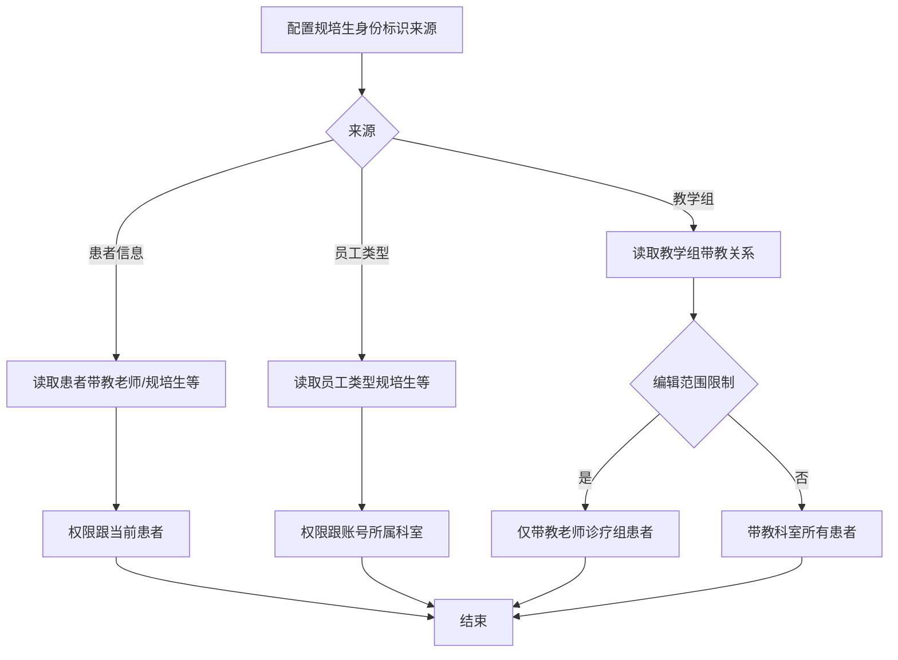
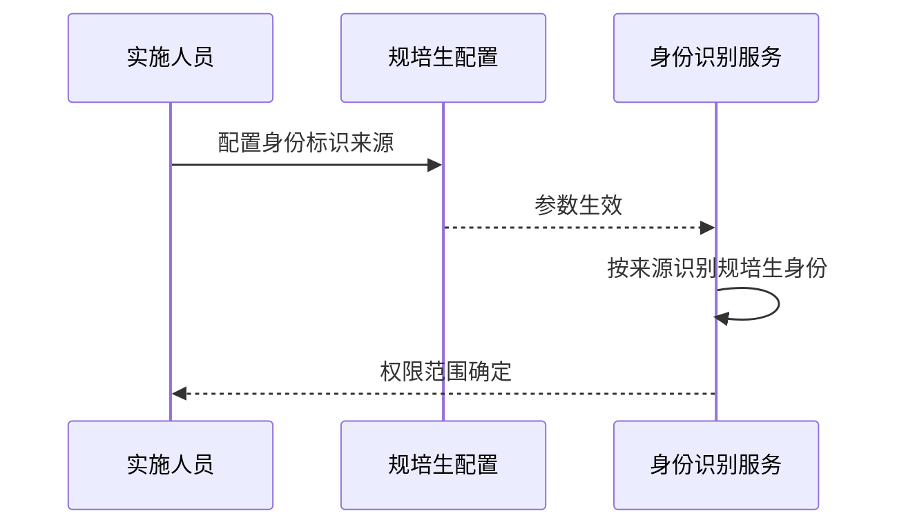

# BLGL-19-BLJXZ-003 规培生身份标识配置 - Spec

> **功能编号**：BLGL-19-BLJXZ-003
> **文档类型**：Spec（研发视角）
> **文档版本**：V1.0
> **编写时间**：2026-08-14
> **编写人**：RACC

---

## 文档索引

#### 章节索引

**Spec（研发视角）**

| 章节号 | 章节名称 | 内容说明 |
|--------|---------|---------|
| 1、 | 文档概述 | 文档目的、文档范围、术语定义、阅读指南、参考文档 |
| 2、 | 功能背景与定位 | 功能背景、功能定位、目标用户、核心价值 |
| 3、 | 业务流程设计 | 主流程/异常流程/边界流程（Given/When/Then） |
| 4、 | 数据模型设计 | 核心数据结构、状态定义、系统参数定义 |
| 5、 | 接口契约设计 | API列表、接口详细设计、错误码定义 |
| 6、 | 技术方案设计 | 页面路径、技术栈、关键技术点、部署方案 |
| 7、 | 测试用例预设计 | 功能/边界/异常/性能测试用例 |
| 8、 | 非功能性要求 | 性能、安全、可用性、兼容性 |
| 9、 | 依赖与风险 | 外部依赖、风险项 |
| 10、 | 附录 | 流程图、时序图、参考文档 |

**PM-Spec（业务视角）**

| 章节号 | 章节名称 | 内容说明 |
|--------|---------|---------|
| 一 | 目标 | 功能定位与核心价值 |
| 二 | 约束 | 业务/技术/非功能性约束 |
| 三 | 验收标准 | 验收条件与验证方法 |
| 四 | 排除范围 | 本次不做项与明确边界 |
| 五 | 关键决策记录 | 方案决策与选型理由 |
| 六 | 优先级 | 优先级定义 |
| 七 | 关联文档 | 关联文档索引 |
| 附录 | 填写检查清单 | 质量检查 |

**Analyst-Spec（产品视角）**

| 章节号 | 章节名称 | 内容说明 |
|--------|---------|---------|
| 一 | 功能编号体系 | 功能编号与层级结构 |
| 二 | 核心业务流程 | 核心业务流程与时序 |
| 三 | 功能规格说明 | 详细功能规格与验收标准 |
| 四 | 排除范围 | 排除范围 |
| 五 | 业务规则清单 | 业务规则清单 |
| 六 | 关联文档 | 关联文档索引 |
| 七 | 待确认问题清单 | 待确认问题汇总 |
| - | 填写检查清单 | 质量检查 |

#### 版本历史

| 版本 | 日期 | 变更说明 | 编写人 |
|------|------|---------|--------|
| V1.0 | 2026-08-14 | 初始版本 | RACC |

#### 关联文档索引

| 序号 | 文档名称 | 文档类型 | 版本 | 位置 |
|------|---------|---------|------|------|
| 1 | BLGL-19-BLJXZ-003_规培生身份标识配置_PM-spec.md | PM-Spec（业务视角） | V0.1 | 本目录 |
| 2 | BLGL-19-BLJXZ-003_规培生身份标识配置_Analyst-spec.md | Analyst-Spec（产品视角） | V1.0 | 本目录 |
| 3 | BLGL-19-BLJXZ-003_规培生身份标识配置-Spec.md | Spec（研发视角） | V1.0 | 本目录 |
| 4 | BLGL-19-BLJXZ 19病历教学组功能点Spec.md | 功能点Spec（模块级） | V1.0 | 上级目录 |

---

## 1、文档概述

### 1.1、文档目的

本文档旨在明确"规培生身份标识配置"功能（BLGL-19-BLJXZ-003）的业务背景与设计方案，为需求分析、研发实现、测试验收及评审提供统一的业务上下文、设计口径与决策依据。

### 1.2、文档范围

#### 1.2.1 纳入范围

本文档覆盖规培生身份标识配置的完整业务背景与设计，包括：

- 规培生身份标识来源参数（患者信息/员工类型/教学组）
- 各来源的权限范围控制
- 规培生配置菜单（参数归类）

#### 1.2.2 排除范围

本文档不涉及以下内容（详见其他功能点或模块）：

- 教学组管理—— BLGL-19-BLJXZ-001
- 规培生病历书写权限—— BLGL-19-BLJXZ-002
- 病历带教字段与归档校验—— BLGL-19-BLJXZ-004
- 规培生配置菜单 —— Phase 1 功能点Spec 第6章基础能力（BC-BLJXZ-004）

### 1.3、术语定义

| 术语 | 定义 |
|------|------|
| 规培生身份标识来源 | 患者信息/员工类型/教学组 |
| 规培生配置菜单 | 规培生相关参数集中配置菜单 |

> ⏳ 待确认：规范术语表待产品文档确认。

### 1.4、阅读指南

- **章节关系**：第1~2章为业务全貌，第3~10章为设计实现层。与 Analyst-Spec、PM-Spec 互相引用保持一致。
- **读者对象**：产品经理/需求分析师读第1~2章；研发读第3~6、9~10章；测试读第3、7~8章；评审人员核对各层一致性。

### 1.5、参考文档

| 序号 | 文档名称 | 版本/日期 |
|------|---------|----------|
| 1 | 【历史需求】住院病历的历史需求.xlsx | - |
| 2 | BLGL-19-BLJXZ-003_规培生身份标识配置_PM-spec.md | V0.1 |
| 3 | BLGL-19-BLJXZ-003_规培生身份标识配置_Analyst-spec.md | V1.0 |
| 4 | BLGL-19-BLJXZ 19病历教学组功能点Spec.md | V1.0 |

---

## 2、功能背景与定位

### 2.1 功能背景

规培生身份标识配置是规培生身份识别的定义态参数，需满足：

- **管理要求**：不同医院人员管理系统不同，规培生身份标识来源有差异，通过参数选择
- **现状痛点**：
  - 规培生身份标识来源固定，不适应不同医院
  - 规培生相关参数分散在通用配置
- **历史需求演进**：从身份标识来源参数建立→ 规培生配置菜单归类

### 2.2 功能定位

"规培生身份标识配置"是 WiNEX 病历管理-病历教学组模块的定义态参数，定位为：

- **身份识别**：配置规培生身份标识来源
- **权限范围**：各来源对应权限范围
- **参数归类**：规培生配置菜单集中管理

### 2.3 目标用户

| 用户角色 | 主要使用场景 |
|---------|-------------|
| 病案管理员/实施人员 | 配置规培生身份标识 |
| 医院信息系统管理员 | 选择身份标识来源 |

### 2.4 核心价值

| 价值维度 | 价值描述 |
|---------|---------|
| 灵活适配 | 身份标识来源可选 |
| 权限准确 | 各来源权限范围明确 |
| 集中管理 | 规培生参数归类 |

---

## 3、业务流程设计（Given/When/Then）

### 3.1 主流程

**Scenario 1: 规培生身份标识来源配置**

```gherkin
Given:
  - 实施人员有配置权限

When:
  - 实施人员配置"规培生身份标识来源"

Then:
  - 选项值：患者信息/员工类型/教学组
  - 默认选择员工类型
  - 各来源对应不同权限范围
```

### 3.2 异常流程

**Scenario 2: 业务异常——患者信息来源**

```gherkin
Given:
  - 规培生身份标识来源=患者信息

When:
  - 规培生识别身份

Then:
  - 读取患者信息里的带教老师/规培生/实习生/进修生
  - 所有权限只跟当前患者有关
```

**Scenario 3: 数据异常——员工类型来源**

```gherkin
Given:
  - 规培生身份标识来源=员工类型

When:
  - 规培生识别身份

Then:
  - 读取员工类型里的规培生/实习生/研究生实习生/进修生
  - 权限跟账号所属科室有关
```

**Scenario 4: 系统异常——教学组来源**

```gherkin
Given:
  - 规培生身份标识来源=教学组

When:
  - 规培生识别身份

Then:
  - 读取教学组里配置的带教老师及带教学生
  - 权限跟教学组所属科室有关
  - ⏳ 待确认：教学组未配置时的处理
```

### 3.3 边界流程

**Scenario 5: 边界场景——参数归类**

```gherkin
Given:
  - 省中规培生模式

When:
  - 配置规培生相关参数

Then:
  - 规培生相关参数挪到专门【规培生配置】菜单
```

**Scenario 6: 边界场景——权限范围参数**

```gherkin
Given:
  - 规培生身份标识来源=教学组

When:
  - 配置"教学组模式下规培生编辑范围是否限制为带教老师诊疗组"

Then:
  - 参数=否：带教科室所有患者
  - 参数=是：带教老师诊疗组患者
```

---

## 4、数据模型设计

> 数据模型信息来自代码扫描（`E:\39EMR\sr-next`）和历史。标注 `` 的来自需求文本。

### 4.1 核心数据结构

#### 4.1.1 系统参数

| 参数编码 | 参数名称 | 默认值 | 说明 |
|---------|---------|--------|------|
| 规培生身份标识来源 | 患者信息/员工类型/教学组 | 员工类型 | 身份识别 |
| 教学组模式下规培生编辑范围限制 | 是/否 | 否 | 编辑范围 |

### 4.2 状态定义

| 状态码 | 状态名称 | 说明 |
|--------|---------|------|
| 患者信息 | 来源 | 权限跟患者 |
| 员工类型 | 来源 | 权限跟科室 |
| 教学组 | 来源 | 权限跟教学组科室 |

### 4.3 系统参数定义

| 参数编码 | 参数名称 | 说明 |
|---------|---------|------|
| 规培生身份标识来源 | 身份标识 | 默认员工类型 |
| 教学组模式编辑范围 | 编辑范围 | 默认否 |

---

## 5、接口契约设计

> 接口信息来自代码扫描（`E:\39EMR\sr-next`）和历史。标注 ``。

### 5.1 API列表

| 序号 | API名称（代码函数） | 路径 | 方法 | 说明 |
|:----:|---------|------|:----:|------|
| 1 | 参数查询/保存 | ⏳ 待确认：主数据参数接口 | POST | 配置规培生身份标识 |

> ⏳ 待确认：参数配置接口契约待接口文档补充。

### 5.2 接口详细设计

#### 5.2.1 参数配置

> ⏳ 待确认：参数查询/保存接口契约待接口文档补充，当前为配置场景描述。

### 5.3 错误码定义

| 错误码 | 错误信息 | 处理方式 |
|--------|---------|---------|
| ⏳ 待确认 | 参数保存失败 | 提示错误并返回配置页 |

> ⏳ 待确认：错误码定义未在代码扫描中提取完整。

---

## 6、技术方案设计

### 6.1 页面路径

- **页面路径**: 住院通用配置→规培生配置菜单
- **前端工程**: 管理端配置页面

> ⏳ 待确认：配置页面组件待代码扫描补充。

### 6.2 技术栈

| 类别 | 技术 | 版本 |
|------|------|------|
| 前端框架 | ⏳ 待确认 | ⏳ 待确认 |
| 后端框架 | ⏳ 待确认 | ⏳ 待确认 |

> ⏳ 待确认：配置服务技术栈待代码扫描。

### 6.3 关键技术点

- 身份标识来源：患者信息/员工类型/教学组
- 权限范围：患者/科室/教学组科室
- 规培生配置菜单：参数归类集中管理

### 6.4 部署方案

⏳ 待确认：部署方案未在资料区中找到。

---

## 7、测试用例预设计

### 7.1 功能测试

| 用例编号 | 测试场景 | Given | When | Then |
|---------|---------|-------|------|------|
| TC-001 | 身份标识来源配置 | 有配置权限 | 配置来源 | 默认员工类型 |

### 7.2 边界测试

| 用例编号 | 测试场景 | Given | When | Then |
|---------|---------|-------|------|------|
| TC-002 | 患者信息来源 | 来源=患者信息 | 识别身份 | 权限跟患者 |
| TC-003 | 教学组来源 | 来源=教学组 | 识别身份 | 权限跟教学组科室 |

### 7.3 异常测试

| 用例编号 | 测试场景 | Given | When | Then |
|---------|---------|-------|------|------|
| TC-004 | 教学组未配置 | 来源=教学组，组未配置 | 识别身份 | ⏳ 待确认：处理方案 |
| TC-005 | 参数归类 | 规培生参数 | 配置菜单 | 规培生配置菜单集中 |

### 7.4 性能测试

| 用例编号 | 测试场景 | 指标 |
|---------|---------|------|
| TC-006 | 参数配置响应 | ⏳ 待确认：性能指标未在资料区中找到 |

---

## 8、非功能性要求

### 8.1 性能要求

| 指标 | 要求 |
|------|------|
| 参数配置响应 | ⏳ 待确认 |

### 8.2 安全要求

| 要求 | 说明 |
|------|------|
| 配置权限 | 仅实施人员可配置 |

**医疗行业特殊要求**

| 要求 | 说明 |
|------|------|
| 身份合规 | 规培生身份识别准确 |

### 8.3 可用性要求

| 指标 | 要求值 |
|------|--------|
| 可用性 | ⏳ 待确认 |

### 8.4 兼容性要求

| 类型 | 要求 |
|------|------|
| 医院兼容 | 支持不同医院身份标识来源 |

---

## 9、依赖与风险

### 9.1 外部依赖

| 依赖项 | 说明 |
|--------|------|
| 主数据系统 | 员工类型 |

### 9.2 风险项

| 风险项 | 等级 | 说明 | 应对方案 |
|--------|------|------|---------|
| 身份识别不准 | 中 | 来源差异导致识别偏差 | 参数适配 |

---

## 10、附录

### 10.1 流程图



### 10.2 时序图



### 10.3 参考文档

- 【历史需求】住院病历的历史需求.xlsx
- BLGL-19-BLJXZ 19病历教学组功能点Spec.md（V1.0，第5章 -003 行）
- 关联Spec: BLGL-19-BLJXZ-002（规培生权限）

---

## 填写检查清单

| 序号 | 检查项 | 是否完成 |
|:----:|--------|:--------:|
| 1 | 章节索引与正文章节一致 | ✅ |
| 2 | 版本历史记录完整 | ✅ |
| 3 | 关联文档索引已登记全部Spec | ✅ |
| 4 | 文档目的明确回答"为什么做/做成什么/怎么做" | ✅ |
| 5 | 纳入范围/排除范围清晰 | ✅ |
| 6 | 术语定义覆盖关键概念，从资料区可溯源 | ✅ |
| 7 | 参考文档已登记 | ✅ |
| 8 | 功能背景基于法规/规范/需求来源组织 | ✅ |
| 9 | 功能定位体现业务价值（3~5个定位点） | ✅ |
| 10 | 目标用户角色覆盖完整，在需求原文中有出处 | ✅ |
| 11 | 核心价值可陈述，与 Phase 1 口径一致 | ✅ |
| 12 | 业务流程：主流程≥1、异常≥3、边界≥2，Given/When/Then 具体 | ✅ |
| 13 | 数据模型：字段/表/状态/参数可溯源 | ✅ |
| 14 | 接口契约：API列表+详细设计+错误码齐全或标记待确认 | ✅ |
| 15 | 技术方案：页面路径/技术栈/关键点/部署方案或标记待确认 | ✅ |
| 16 | 测试用例：功能/边界/异常/性能覆盖 | ✅ |
| 17 | 非功能性要求：性能/安全/可用性/兼容性指标可量化或标记待确认 | ✅ |
| 18 | 依赖与风险：外部依赖登记完整 | ✅ |
| 19 | 附录：流程图/时序图与正文流程一致 | ✅ |
| 20 | 全文无占位符 `< >` 残留 | ✅ |
| 21 | 全文陈述可溯源至资料区 | ✅ |
| 22 | 人工审核确认完成 | ⏳ 待确认 |

---

**文档状态**：⬜ 待审核
**维护责任**：RACC
**下次更新**：根据评审反馈优化
