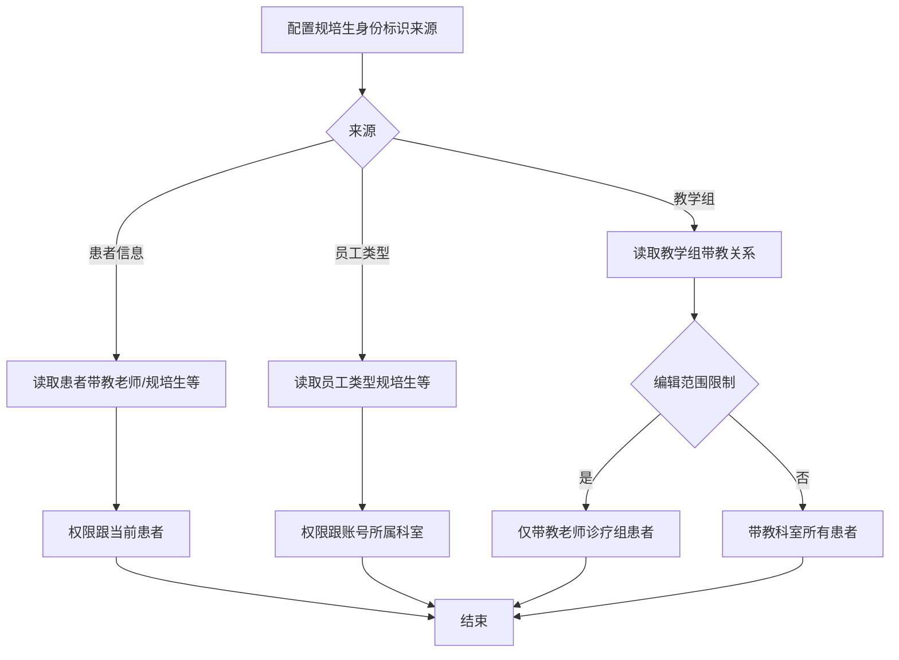
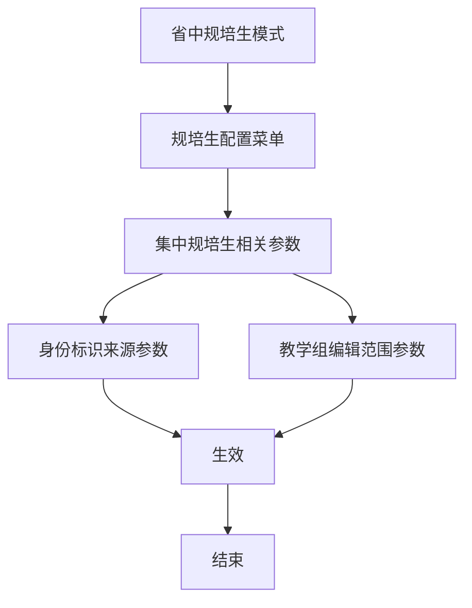

# BLGL-19-BLJXZ-003规培生身份标识配置_ Analyst - Spec

> **需求编号**：BLGL-19-BLJXZ-003
> **父需求**：BLGL-19-BLJXZ
> **关联PM Spec**：BLGL-19-BLJXZ-003_规培生身份标识配置_PM-spec.md
> **Spec版本**：V1.0
> **编写时间**：2026-08-14
> **编写人**：需求分析师

---

## 一、功能编号体系

### 1.1 功能层级结构

```
BLGL-19-BLJXZ-003: 规培生身份标识配置
  ├─ BLGL-19-BLJXZ-003-01: 身份标识来源配置
  │   ├─ -01-01: 患者信息来源
  │   ├─ -01-02: 员工类型来源
  │   └─ -01-03: 教学组来源
  ├─ BLGL-19-BLJXZ-003-02: 权限范围控制
  │   ├─ -02-01: 患者权限（跟当前患者）
  │   ├─ -02-02: 科室权限（跟账号所属科室）
  │   └─ -02-03: 教学组权限（跟教学组科室）
  └─ BLGL-19-BLJXZ-003-03: 规培生参数归类
      └─ -03-01: 规培生配置菜单
```

### 1.2 功能编号表

| REQ-ID | 功能名称 | 类型 | 优先级 | 说明 |
|--------|---------|------|--------|------|
| BLGL-19-BLJXZ-003-01 | 身份标识来源配置 | 功能 | P0 | 三来源 |
| BLGL-19-BLJXZ-003-01-01 | 患者信息来源 | 子功能 | P0 | 患者带教字段 |
| BLGL-19-BLJXZ-003-01-02 | 员工类型来源 | 子功能 | P0 | 员工类型 |
| BLGL-19-BLJXZ-003-01-03 | 教学组来源 | 子功能 | P0 | 教学组带教 |
| BLGL-19-BLJXZ-003-02 | 权限范围控制 | 功能 | P1 | 权限范围 |
| BLGL-19-BLJXZ-003-02-01 | 患者权限 | 子功能 | P1 | 跟当前患者 |
| BLGL-19-BLJXZ-003-02-02 | 科室权限 | 子功能 | P1 | 跟科室 |
| BLGL-19-BLJXZ-003-02-03 | 教学组权限 | 子功能 | P1 | 跟教学组科室 |
| BLGL-19-BLJXZ-003-03 | 规培生参数归类 | 功能 | P1 | 配置菜单 |
| BLGL-19-BLJXZ-003-03-01 | 规培生配置菜单 | 子功能 | P1 | 参数集中 |

---

## 二、核心业务流程

### 2.1 身份标识来源流程



### 2.2 规培生配置菜单流程



---

## 三、功能规格说明

---

### BLGL-19-BLJXZ-003-01: 身份标识来源配置

#### 3.1.1 功能概述

配置规培生身份标识来源参数（患者信息/员工类型/教学组），默认员工类型，各来源读取不同身份数据。

#### 3.1.2 用户角色

| 角色 | 使用场景 | 权限要求 | 操作频率 |
|------|---------|---------|---------|
| 实施人员/医院信息系统管理员 | 配置身份标识来源 | 配置权限 | 低频 |

#### 3.1.3 业务流程（Given/When/Then）

##### 主流程

**Scenario 1: 规培生身份标识来源配置**

```gherkin
Given:
  - 实施人员有配置权限

When:
  - 实施人员配置"规培生身份标识来源"

Then:
  - 选项值：患者信息/员工类型/教学组
  - 默认选择员工类型
  - 各来源对应不同权限范围
```

##### 异常流程

**Scenario 2: 业务异常——患者信息来源**

```gherkin
Given:
  - 规培生身份标识来源=患者信息

When:
  - 规培生识别身份

Then:
  - 读取患者信息里的带教老师/规培生/实习生/进修生
  - 所有权限只跟当前患者有关
```

**Scenario 3: 数据异常——教学组来源**

```gherkin
Given:
  - 规培生身份标识来源=教学组

When:
  - 规培生识别身份

Then:
  - 读取教学组里配置的带教老师及带教学生
  - 权限跟教学组所属科室有关
  - ⏳ 待确认：教学组未配置时的处理
```

##### 边界流程

**Scenario 4: 边界场景——员工类型来源**

```gherkin
Given:
  - 规培生身份标识来源=员工类型

When:
  - 规培生识别身份

Then:
  - 读取员工类型里的规培生/实习生/研究生实习生/进修生
  - 权限跟账号所属科室有关
```

**Scenario 5: 边界场景——默认值**

```gherkin
Given:
  - 实施人员未配置身份标识来源

When:
  - 使用默认值

Then:
  - 默认选择员工类型
```

#### 3.1.5 验收标准

| AC编号 | 验收标准 | 对应REQ-ID | 验证方法 | 验证场景 |
|--------|---------|-----------|---------|---------|
| AC-001 | 规培生身份标识来源参数可选{患者信息，员工类型，教学组}，默认员工类型 | -003-01 | 功能测试 | Scenario 1 |
| AC-002 | 患者信息来源时读取患者信息身份 | -003-01 | 功能测试 | Scenario 2 |
| AC-003 | 员工类型来源时读取员工类型身份 | -003-01 | 功能测试 | Scenario 4 |

---

### BLGL-19-BLJXZ-003-02: 权限范围控制

#### 3.2.1 功能概述

各身份标识来源对应不同权限范围：患者/科室/教学组科室，教学组来源时编辑范围按参数控制。

#### 3.2.2 用户角色

| 角色 | 使用场景 | 权限要求 | 操作频率 |
|------|---------|---------|---------|
| 规培生 | 病历编辑（按权限范围） | 身份识别 | 高频 |

#### 3.2.3 业务流程（Given/When/Then）

##### 主流程

**Scenario 1: 权限范围控制**

```gherkin
Given:
  - 规培生身份标识来源已配置

When:
  - 规培生编辑病历

Then:
  - 患者信息来源：权限跟当前患者
  - 员工类型来源：权限跟账号所属科室
  - 教学组来源：权限跟教学组所属科室
```

##### 边界流程

**Scenario 2: 边界场景——教学组编辑范围**

```gherkin
Given:
  - 规培生身份标识来源=教学组

When:
  - 配置"教学组模式下规培生编辑范围是否限制为带教老师诊疗组"

Then:
  - 参数=否：带教科室所有患者
  - 参数=是：带教老师诊疗组患者
```

#### 3.2.5 验收标准

| AC编号 | 验收标准 | 对应REQ-ID | 验证方法 | 验证场景 |
|--------|---------|-----------|---------|---------|
| AC-004 | 患者信息来源时权限跟当前患者 | -003-02 | 功能测试 | Scenario 1 |
| AC-005 | 员工类型来源时权限跟账号所属科室 | -003-02 | 功能测试 | Scenario 1 |
| AC-006 | 教学组来源时权限跟教学组所属科室 | -003-02 | 功能测试 | Scenario 1 |

---

### BLGL-19-BLJXZ-003-03: 规培生参数归类

#### 3.3.1 功能概述

将通用配置中的规培生相关参数挪到专门的【规培生配置】菜单集中管理。

#### 3.3.2 用户角色

| 角色 | 使用场景 | 权限要求 | 操作频率 |
|------|---------|---------|---------|
| 实施人员 | 配置规培生参数 | 配置权限 | 低频 |

#### 3.3.3 业务流程（Given/When/Then）

##### 主流程

**Scenario 1: 规培生配置菜单**

```gherkin
Given:
  - 省中规培生模式

When:
  - 配置规培生相关参数

Then:
  - 规培生相关参数挪到专门【规培生配置】菜单
```

#### 3.3.5 验收标准

| AC编号 | 验收标准 | 对应REQ-ID | 验证方法 | 验证场景 |
|--------|---------|-----------|---------|---------|
| AC-007 | 规培生相关参数在规培生配置菜单集中 | -003-03 | 功能测试 | Scenario 1 |

---

## 四、排除范围

本需求不包含以下功能项：

1. **教学组管理** - 属 BLGL-19-BLJXZ-001
2. **规培生病历书写权限** - 属 BLGL-19-BLJXZ-002
3. **病历带教字段与归档校验** - 属 BLGL-19-BLJXZ-004
4. **规培生配置菜单实现** - 属基础能力 BC-BLJXZ-004

> 与 PM-Spec 第四章一致。对照 Phase 1 功能点Spec 第6章（基线能力），确保不越界。

---

## 五、业务规则清单

| 规则ID | 规则名称 | 规则描述 | 来源 | 优先级 |
|--------|---------|---------|------|--------|
| BR-001 | 身份标识来源 | 规培生身份标识来源{患者信息，员工类型，教学组}，默认员工类型 | | P0 |
| BR-002 | 患者权限 | 患者信息来源权限跟当前患者 | | P1 |
| BR-003 | 科室权限 | 员工类型来源权限跟账号所属科室 | | P1 |
| BR-004 | 教学组权限 | 教学组来源权限跟教学组科室 | | P1 |
| BR-005 | 参数归类 | 规培生参数挪到规培生配置菜单 | | P1 |

---

## 六、关联文档

| 文档类型 | 文档路径 | 说明 |
|---------|---------|------|
| PM-Spec（业务视角） | 本目录 BLGL-19-BLJXZ-003_规培生身份标识配置_PM-spec.md（V0.1） | PM 产出的 Spec 文档 |
| Spec（研发视角） | 本目录 BLGL-19-BLJXZ-003_规培生身份标识配置-Spec.md（V1.0） | 业务背景与目标 Spec |
| 功能点Spec（模块级） | BLGL-19-BLJXZ 19病历教学组功能点Spec.md（V1.0，上级目录） | Phase 1 功能点索引 |
| data-model.md | 待产出 | 架构师产出的数据建模文档 |
| design.md | 待产出 | 架构师产出的技术方案文档 |
| api-contract.md | 待产出 | 开发经理产出的 API 契约文档 |

---

## 七、待确认问题清单

| 编号 | 问题描述 | 缺失信息 | 影响范围 | 建议补充方 |
|------|---------|---------|---------|-----------|
| Q-001 | 教学组未配置处理 | 教学组来源时未配置的降级 | 3.1.3 Scenario 3 | 产品经理 |
| Q-002 | 参数接口契约 | 身份标识参数查询/保存接口 | 第5章接口设计 | 开发经理 |
| Q-003 | 概念ID、性能指标 | 参数概念ID、配置SLA | 数据模型、非功能 | 架构师/产品经理 |

---

## 填写检查清单

| 序号 | 检查项 | 是否完成 |
|:----:|--------|:--------:|
| 1 | 功能编号带父子层级 | ✅ |
| 2 | 每个 REQ-ID 有功能概述和用户角色 | ✅ |
| 3 | 主流程至少 1 个 Given/When/Then 场景 | ✅ |
| 4 | 异常流程至少 3 个 Given/When/Then 场景 | ✅ |
| 5 | 边界流程至少 2 个 Given/When/Then 场景 | ✅ |
| 6 | 每个 Given/When/Then 内容具体，不模糊 | ✅ |
| 7 | 数据字段定义完整 | ✅ |
| 8 | 验收标准 AC 编号独立，可验证 | ✅ |
| 9 | 验收标准无"功能正常"等模糊表述 | ✅ |
| 10 | 排除范围明确列出 | ✅ |
| 11 | 业务规则清单列出所有规则，每条标注来源 | ✅ |
| 12 | 流程图使用 Mermaid 格式（≥2 个） | ✅ |
| 13 | 关联文档索引包含 Phase 1 功能点Spec | ✅ |
| 14 | 待确认问题清单汇总了全文所有 ⏳ 项 | ✅ |
| 15 | 全文无占位符 `< >` 残留 | ✅ |
| 16 | 全文陈述可溯源至资料区（S1~S10 溯源核查） | ✅ |
| 17 | 人工审核确认完成 | ⏳ 待确认 |

---

**文档状态**：⬜ 待审核
**维护责任**：需求分析师规范组
**下次更新**：根据评审反馈优化

---

## 版本历史

| 版本 | 日期 | 变更说明 | 编写人 |
|------|------|---------|--------|
| V1.0 | 2026-08-14 | 初始版本 | 需求分析师 |
