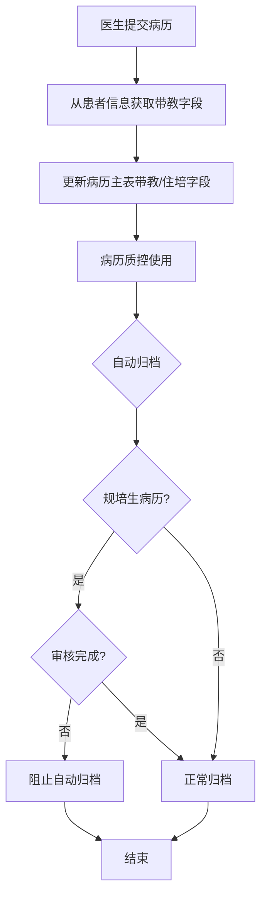
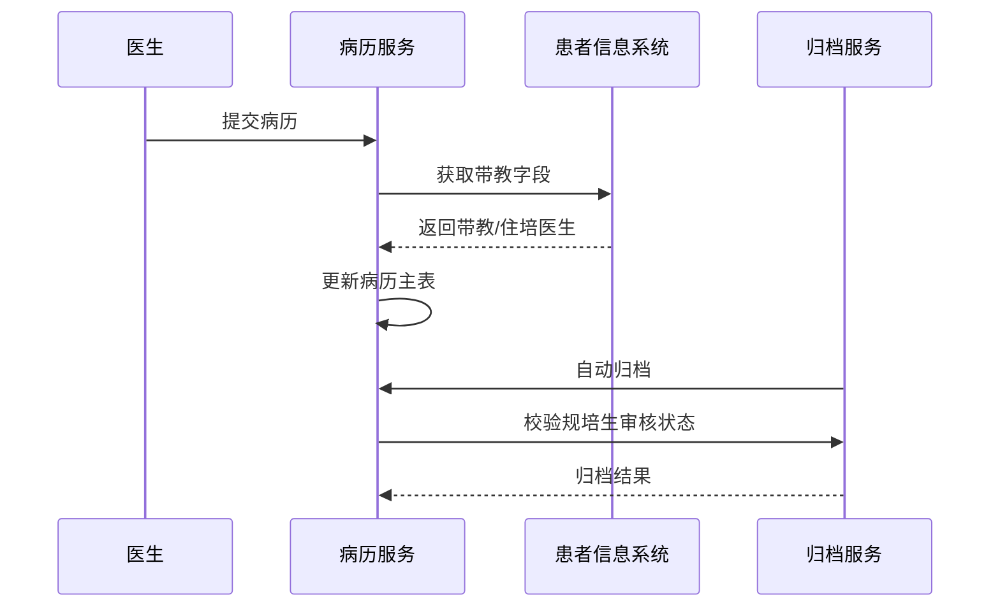

# BLGL-19-BLJXZ-004 病历带教字段与归档校验 - Spec

> **功能编号**：BLGL-19-BLJXZ-004
> **文档类型**：Spec（研发视角）
> **文档版本**：V1.0
> **编写时间**：2026-08-14
> **编写人**：RACC

---

## 文档索引

#### 章节索引

**Spec（研发视角）**

| 章节号 | 章节名称 | 内容说明 |
|--------|---------|---------|
| 1、 | 文档概述 | 文档目的、文档范围、术语定义、阅读指南、参考文档 |
| 2、 | 功能背景与定位 | 功能背景、功能定位、目标用户、核心价值 |
| 3、 | 业务流程设计 | 主流程/异常流程/边界流程（Given/When/Then） |
| 4、 | 数据模型设计 | 核心数据结构、状态定义、系统参数定义 |
| 5、 | 接口契约设计 | API列表、接口详细设计、错误码定义 |
| 6、 | 技术方案设计 | 页面路径、技术栈、关键技术点、部署方案 |
| 7、 | 测试用例预设计 | 功能/边界/异常/性能测试用例 |
| 8、 | 非功能性要求 | 性能、安全、可用性、兼容性 |
| 9、 | 依赖与风险 | 外部依赖、风险项 |
| 10、 | 附录 | 流程图、时序图、参考文档 |

**PM-Spec（业务视角）**

| 章节号 | 章节名称 | 内容说明 |
|--------|---------|---------|
| 一 | 目标 | 功能定位与核心价值 |
| 二 | 约束 | 业务/技术/非功能性约束 |
| 三 | 验收标准 | 验收条件与验证方法 |
| 四 | 排除范围 | 本次不做项与明确边界 |
| 五 | 关键决策记录 | 方案决策与选型理由 |
| 六 | 优先级 | 优先级定义 |
| 七 | 关联文档 | 关联文档索引 |
| 附录 | 填写检查清单 | 质量检查 |

**Analyst-Spec（产品视角）**

| 章节号 | 章节名称 | 内容说明 |
|--------|---------|---------|
| 一 | 功能编号体系 | 功能编号与层级结构 |
| 二 | 核心业务流程 | 核心业务流程与时序 |
| 三 | 功能规格说明 | 详细功能规格与验收标准 |
| 四 | 排除范围 | 排除范围 |
| 五 | 业务规则清单 | 业务规则清单 |
| 六 | 关联文档 | 关联文档索引 |
| 七 | 待确认问题清单 | 待确认问题汇总 |
| - | 填写检查清单 | 质量检查 |

#### 版本历史

| 版本 | 日期 | 变更说明 | 编写人 |
|------|------|---------|--------|
| V1.0 | 2026-08-14 | 初始版本 | RACC |

#### 关联文档索引

| 序号 | 文档名称 | 文档类型 | 版本 | 位置 |
|------|---------|---------|------|------|
| 1 | BLGL-19-BLJXZ-004_病历带教字段与归档校验_PM-spec.md | PM-Spec（业务视角） | V0.1 | 本目录 |
| 2 | BLGL-19-BLJXZ-004_病历带教字段与归档校验_Analyst-spec.md | Analyst-Spec（产品视角） | V1.0 | 本目录 |
| 3 | BLGL-19-BLJXZ-004_病历带教字段与归档校验-Spec.md | Spec（研发视角） | V1.0 | 本目录 |
| 4 | BLGL-19-BLJXZ 19病历教学组功能点Spec.md | 功能点Spec（模块级） | V1.0 | 上级目录 |

---

## 1、文档概述

### 1.1、文档目的

本文档旨在明确"病历带教字段与归档校验"功能（BLGL-19-BLJXZ-004）的业务背景与设计方案，为需求分析、研发实现、测试验收及评审提供统一的业务上下文、设计口径与决策依据。

### 1.2、文档范围

#### 1.2.1 纳入范围

本文档覆盖病历带教字段与归档校验的完整业务背景与设计，包括：

- 病历主表增加带教老师、住培医生字段（从患者信息获取）
- 每次提交病历时更新带教字段
- 规培医生无执业证提交后审核状态归档校验
- 自动归档时校验规培生提交病历审核状态

#### 1.2.2 排除范围

本文档不涉及以下内容（详见其他功能点或模块）：

- 教学组管理—— BLGL-19-BLJXZ-001
- 规培生病历书写权限—— BLGL-19-BLJXZ-002
- 规培生身份标识配置—— BLGL-19-BLJXZ-003
- 病历带教字段展示、床位卡展示、自动归档校验实现 —— Phase 1 功能点Spec 第6章基础能力（BC-BLJXZ-001、002、005）

### 1.3、术语定义

| 术语 | 定义 |
|------|------|
| 带教老师字段 | 病历主表新增字段，从患者信息获取 |
| 住培医生字段 | 病历主表新增字段 |
| 归档校验 | 规培生提交病历审核状态归档校验 |

> ⏳ 待确认：规范术语表待产品文档确认。

### 1.4、阅读指南

- **章节关系**：第1~2章为业务全貌，第3~10章为设计实现层。与 Analyst-Spec、PM-Spec 互相引用保持一致。
- **读者对象**：产品经理/需求分析师读第1~2章；研发读第3~6、9~10章；测试读第3、7~8章；评审人员核对各层一致性。

### 1.5、参考文档

| 序号 | 文档名称 | 版本/日期 |
|------|---------|----------|
| 1 | 【历史需求】住院病历的历史需求.xlsx | - |
| 2 | BLGL-19-BLJXZ-004_病历带教字段与归档校验_PM-spec.md | V0.1 |
| 3 | BLGL-19-BLJXZ-004_病历带教字段与归档校验_Analyst-spec.md | V1.0 |
| 4 | BLGL-19-BLJXZ 19病历教学组功能点Spec.md | V1.0 |

---

## 2、功能背景与定位

### 2.1 功能背景

病历带教字段与归档校验是规培生病历的质控与归档合规支撑，需满足：

- **管理要求**：住院病历增加规培生和带教老师字段用于获取患者信息，支撑病历质控
- **现状痛点**：
  - 病历主表缺少带教字段，质控无法追溯带教关系
  - 规培生无执业证提交病历未审核可能被自动归档
- **历史需求演进**：从病历带教字段建立→ 规培生归档审核校验

### 2.2 功能定位

"病历带教字段与归档校验"是 WiNEX 病历管理-病历教学组模块的质控归档支撑，定位为：

- **带教字段**：病历主表带教/住培医生字段
- **质控支撑**：带教字段供病历质控
- **归档合规**：规培生提交病历审核状态归档校验

### 2.3 目标用户

| 用户角色 | 主要使用场景 |
|---------|-------------|
| 病历质控 | 查看带教字段 |
| 病案管理员 | 自动归档校验规培生审核状态 |

### 2.4 核心价值

| 价值维度 | 价值描述 |
|---------|---------|
| 质控追溯 | 带教字段支撑质控 |
| 归档合规 | 规培生未审核病历阻止归档 |
| 数据完整 | 提交病历时更新带教字段 |

---

## 3、业务流程设计（Given/When/Then）

### 3.1 主流程

**Scenario 1: 病历带教字段更新**

```gherkin
Given:
  - 病历主表已增加带教老师/住培医生字段

When:
  - 医生提交病历

Then:
  - 从患者信息获取带教老师、住培医生字段
  - 更新到病历主表
  - 供病历质控使用
```

### 3.2 异常流程

**Scenario 2: 业务异常——历史数据处理**

```gherkin
Given:
  - 已有历史病历无带教字段

When:
  - 新增带教字段后

Then:
  - 需要SQL处理历史数据
  - 从患者信息获取带教老师字段填充到病历主表
```

**Scenario 3: 数据异常——归档审核校验**

```gherkin
Given:
  - 规培生（无执业证）提交病历
  - 病历未审核

When:
  - 自动归档程序执行

Then:
  - 校验规培生提交病历的审核状态
  - 未审核完成的病历阻止自动归档
```

**Scenario 4: 系统异常——归档校验参数**

```gherkin
Given:
  - 参数控制自动归档时校验规培生审核状态

When:
  - 自动归档

Then:
  - 参数开启时校验审核状态
  - ⏳ 待确认：参数未生效时的处理
```

### 3.3 边界流程

**Scenario 5: 边界场景——床位卡带教展示**

```gherkin
Given:
  - 病历主表有带教字段

When:
  - 床位卡展示

Then:
  - 床位卡显示"住培医生：XXX；带教老师：XXX"
```

**Scenario 6: 边界场景——规培生已审核归档**

```gherkin
Given:
  - 规培生提交病历已审核

When:
  - 自动归档

Then:
  - 审核完成病历可正常归档
```

---

## 4、数据模型设计

> 数据模型信息来自代码扫描（`E:\39EMR\sr-next`）和历史。标注 `` 的来自需求文本。

### 4.1 核心数据结构

#### 4.1.1 核心表/实体

| 表/实体 | 关键字段 | 说明 |
|---------|---------|------|
| 病历主表 | 带教老师、住培医生 | 新增带教字段 |
| 患者信息表 | 带教老师、规培生 | 带教字段来源 |
| 归档记录 | 审核状态 | 归档审核校验 |

> ⏳ 待确认：完整数据表清单待代码扫描或功能清单数据表清单补充。

### 4.2 状态定义

| 状态码 | 状态名称 | 说明 |
|--------|---------|------|
| 未审核 | 规培生病历 | 阻止自动归档 |
| 已审核 | 规培生病历 | 可正常归档 |

### 4.3 系统参数定义

| 参数编码 | 参数名称 | 说明 |
|---------|---------|------|
| COMMON366 | 自动归档时校验未提交病历 | 已有参数 |
| 校验规培生审核状态参数 | 规培生归档校验 | 新增参数 |

---

## 5、接口契约设计

> 接口信息来自代码扫描（`E:\39EMR\sr-next`）和历史。标注 ``。

### 5.1 API列表

| 序号 | API名称（代码函数） | 路径 | 方法 | 说明 |
|:----:|---------|------|:----:|------|
| 1 | 自动归档接口 | ⏳ 待确认：归档接口 | POST | 归档时校验规培生审核状态 |

> ⏳ 待确认：归档校验接口契约待接口文档补充。

### 5.2 接口详细设计

#### 5.2.1 自动归档校验

> ⏳ 待确认：归档接口契约待接口文档补充，当前为校验场景描述。

### 5.3 错误码定义

| 错误码 | 错误信息 | 处理方式 |
|--------|---------|---------|
| ⏳ 待确认 | 规培生病历未审核，阻止归档 | 阻止自动归档 |

> ⏳ 待确认：错误码定义未在代码扫描中提取完整。

---

## 6、技术方案设计

### 6.1 页面路径

- **页面路径**: 病历书写（提交更新带教字段）；病历归档（自动归档校验）
- **前端工程**: 住院医生站/病历归档

> ⏳ 待确认：页面组件待代码扫描补充。

### 6.2 技术栈

| 类别 | 技术 | 版本 |
|------|------|------|
| 前端框架 | ⏳ 待确认 | ⏳ 待确认 |
| 后端框架 | ⏳ 待确认 | ⏳ 待确认 |

> ⏳ 待确认：技术栈待代码扫描。

### 6.3 关键技术点

- 带教字段：病历主表增加带教老师/住培医生字段
- 提交更新：每次提交病历时更新带教字段
- 历史数据：SQL处理从患者信息填充带教字段
- 归档校验：自动归档时校验规培生审核状态

### 6.4 部署方案

⏳ 待确认：部署方案未在资料区中找到。

---

## 7、测试用例预设计

### 7.1 功能测试

| 用例编号 | 测试场景 | Given | When | Then |
|---------|---------|-------|------|------|
| TC-001 | 提交更新带教字段 | 病历主表有带教字段 | 提交病历 | 从患者信息更新 |
| TC-002 | 规培生归档校验 | 规培生未审核 | 自动归档 | 阻止归档 |

### 7.2 边界测试

| 用例编号 | 测试场景 | Given | When | Then |
|---------|---------|-------|------|------|
| TC-003 | 已审核归档 | 规培生已审核 | 自动归档 | 可正常归档 |
| TC-004 | 床位卡带教展示 | 病历有带教字段 | 床位卡展示 | 显示住培医生/带教老师 |

### 7.3 异常测试

| 用例编号 | 测试场景 | Given | When | Then |
|---------|---------|-------|------|------|
| TC-005 | 历史数据处理 | 历史病历无带教字段 | SQL填充 | 从患者信息填充 |
| TC-006 | 归档校验参数 | 参数开启 | 自动归档 | ⏳ 待确认：校验生效 |

### 7.4 性能测试

| 用例编号 | 测试场景 | 指标 |
|---------|---------|------|
| TC-007 | 归档校验响应 | ⏳ 待确认：性能指标未在资料区中找到 |

---

## 8、非功能性要求

### 8.1 性能要求

| 指标 | 要求 |
|------|------|
| 归档校验响应 | ⏳ 待确认 |

### 8.2 安全要求

| 要求 | 说明 |
|------|------|
| 归档合规 | 规培生未审核病历阻止归档 |

**医疗行业特殊要求**

| 要求 | 说明 |
|------|------|
| 带教质控 | 带教字段支撑病历质控 |

### 8.3 可用性要求

| 指标 | 要求值 |
|------|--------|
| 可用性 | ⏳ 待确认 |

### 8.4 兼容性要求

| 类型 | 要求 |
|------|------|
| 历史数据兼容 | SQL处理历史病历带教字段 |

---

## 9、依赖与风险

### 9.1 外部依赖

| 依赖项 | 说明 |
|--------|------|
| 患者信息系统 | 带教字段来源 |

### 9.2 风险项

| 风险项 | 等级 | 说明 | 应对方案 |
|--------|------|------|---------|
| 归档不合规 | 中 | 规培生未审核归档 | 审核状态校验 |
| 历史数据缺失 | 中 | 历史病历无带教字段 | SQL填充 |

---

## 10、附录

### 10.1 流程图



### 10.2 时序图



### 10.3 参考文档

- 【历史需求】住院病历的历史需求.xlsx
- BLGL-19-BLJXZ 19病历教学组功能点Spec.md（V1.0，第5章 -004 行）
- 关联Spec: BLGL-19-BLJXZ-002（规培生权限）、-003（身份标识）

---

## 填写检查清单

| 序号 | 检查项 | 是否完成 |
|:----:|--------|:--------:|
| 1 | 章节索引与正文章节一致 | ✅ |
| 2 | 版本历史记录完整 | ✅ |
| 3 | 关联文档索引已登记全部Spec | ✅ |
| 4 | 文档目的明确回答"为什么做/做成什么/怎么做" | ✅ |
| 5 | 纳入范围/排除范围清晰 | ✅ |
| 6 | 术语定义覆盖关键概念，从资料区可溯源 | ✅ |
| 7 | 参考文档已登记 | ✅ |
| 8 | 功能背景基于法规/规范/需求来源组织 | ✅ |
| 9 | 功能定位体现业务价值（3~5个定位点） | ✅ |
| 10 | 目标用户角色覆盖完整，在需求原文中有出处 | ✅ |
| 11 | 核心价值可陈述，与 Phase 1 口径一致 | ✅ |
| 12 | 业务流程：主流程≥1、异常≥3、边界≥2，Given/When/Then 具体 | ✅ |
| 13 | 数据模型：字段/表/状态/参数可溯源 | ✅ |
| 14 | 接口契约：API列表+详细设计+错误码齐全或标记待确认 | ✅ |
| 15 | 技术方案：页面路径/技术栈/关键点/部署方案或标记待确认 | ✅ |
| 16 | 测试用例：功能/边界/异常/性能覆盖 | ✅ |
| 17 | 非功能性要求：性能/安全/可用性/兼容性指标可量化或标记待确认 | ✅ |
| 18 | 依赖与风险：外部依赖登记完整 | ✅ |
| 19 | 附录：流程图/时序图与正文流程一致 | ✅ |
| 20 | 全文无占位符 `< >` 残留 | ✅ |
| 21 | 全文陈述可溯源至资料区 | ✅ |
| 22 | 人工审核确认完成 | ⏳ 待确认 |

---

**文档状态**：⬜ 待审核
**维护责任**：RACC
**下次更新**：根据评审反馈优化
