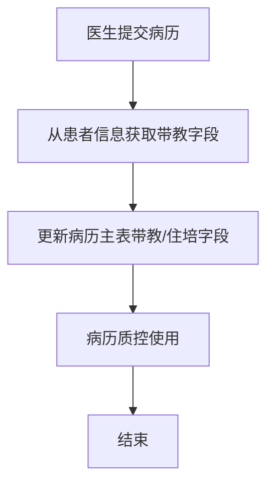
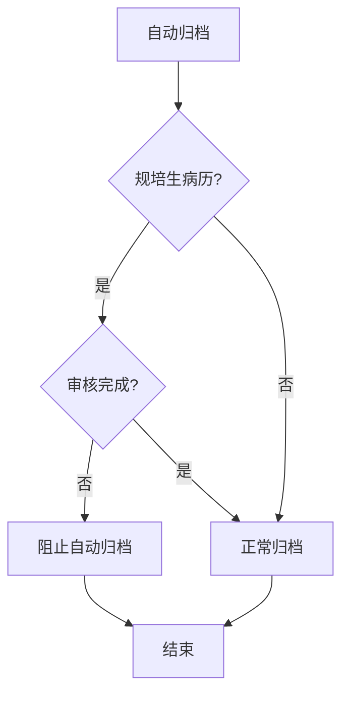

# BLGL-19-BLJXZ-004病历带教字段与归档校验_ Analyst - Spec

> **需求编号**：BLGL-19-BLJXZ-004
> **父需求**：BLGL-19-BLJXZ
> **关联PM Spec**：BLGL-19-BLJXZ-004_病历带教字段与归档校验_PM-spec.md
> **Spec版本**：V1.0
> **编写时间**：2026-08-14
> **编写人**：需求分析师

---

## 一、功能编号体系

### 1.1 功能层级结构

```
BLGL-19-BLJXZ-004: 病历带教字段与归档校验
  ├─ BLGL-19-BLJXZ-004-01: 病历带教字段更新
  │   ├─ -01-01: 病历主表带教/住培字段
  │   ├─ -01-02: 提交时更新字段
  │   └─ -01-03: 历史数据SQL填充
  ├─ BLGL-19-BLJXZ-004-02: 规培生归档校验
  │   ├─ -02-01: 自动归档审核状态校验
  │   └─ -02-02: 未审核阻止归档
  └─ BLGL-19-BLJXZ-004-03: 带教字段展示（支撑）
      └─ -03-01: 床位卡带教展示
```

### 1.2 功能编号表

| REQ-ID | 功能名称 | 类型 | 优先级 | 说明 |
|--------|---------|------|--------|------|
| BLGL-19-BLJXZ-004-01 | 病历带教字段更新 | 功能 | P0 | 带教字段 |
| BLGL-19-BLJXZ-004-01-01 | 带教/住培字段 | 子功能 | P0 | 病历主表字段 |
| BLGL-19-BLJXZ-004-01-02 | 提交更新字段 | 子功能 | P0 | 每次提交 |
| BLGL-19-BLJXZ-004-01-03 | 历史数据填充 | 子功能 | P1 | SQL处理 |
| BLGL-19-BLJXZ-004-02 | 规培生归档校验 | 功能 | P0 | 归档校验 |
| BLGL-19-BLJXZ-004-02-01 | 自动归档校验 | 子功能 | P0 | 审核状态 |
| BLGL-19-BLJXZ-004-02-02 | 未审核阻止归档 | 子功能 | P1 | 阻止归档 |
| BLGL-19-BLJXZ-004-03 | 带教字段展示 | 功能 | P1 | 展示 |
| BLGL-19-BLJXZ-004-03-01 | 床位卡带教展示 | 子功能 | P1 | 住培/带教老师 |

---

## 二、核心业务流程

### 2.1 病历带教字段更新流程



### 2.2 规培生归档校验流程



---

## 三、功能规格说明

---

### BLGL-19-BLJXZ-004-01: 病历带教字段更新

#### 3.1.1 功能概述

病历主表增加带教老师/住培医生字段，从患者信息获取，每次提交病历时更新，历史数据SQL填充。

#### 3.1.2 用户角色

| 角色 | 使用场景 | 权限要求 | 操作频率 |
|------|---------|---------|---------|
| 住院医生 | 提交病历更新带教字段 | 病历权限 | 高频 |
| 病历质控 | 查看带教字段 | 质控权限 | 中频 |

#### 3.1.3 业务流程（Given/When/Then）

##### 主流程

**Scenario 1: 病历带教字段更新**

```gherkin
Given:
  - 病历主表已增加带教老师/住培医生字段

When:
  - 医生提交病历

Then:
  - 从患者信息获取带教老师、住培医生字段
  - 更新到病历主表
  - 供病历质控使用
```

##### 异常流程

**Scenario 2: 业务异常——历史数据处理**

```gherkin
Given:
  - 已有历史病历无带教字段

When:
  - 新增带教字段后

Then:
  - 需要SQL处理历史数据
  - 从患者信息获取带教老师字段填充到病历主表
```

##### 边界流程

**Scenario 3: 边界场景——床位卡带教展示**

```gherkin
Given:
  - 病历主表有带教字段

When:
  - 床位卡展示

Then:
  - 床位卡显示"住培医生：XXX；带教老师：XXX"
```

#### 3.1.5 验收标准

| AC编号 | 验收标准 | 对应REQ-ID | 验证方法 | 验证场景 |
|--------|---------|-----------|---------|---------|
| AC-001 | 病历主表带教老师/住培医生字段从患者信息获取，每次提交更新 | -004-01 | 功能测试 | Scenario 1 |
| AC-002 | 历史病历带教字段SQL填充 | -004-01 | 集成测试 | Scenario 2 |
| AC-003 | 床位卡显示住培医生/带教老师 | -004-01 | 功能测试 | Scenario 3 |

---

### BLGL-19-BLJXZ-004-02: 规培生归档校验

#### 3.2.1 功能概述

自动归档时校验规培生提交病历审核状态，未审核完成阻止自动归档。

#### 3.2.2 用户角色

| 角色 | 使用场景 | 权限要求 | 操作频率 |
|------|---------|---------|---------|
| 病案管理员 | 自动归档 | 归档权限 | 中频 |
| 规培生 | 提交病历（被校验） | 规培生权限 | 高频 |

#### 3.2.3 业务流程（Given/When/Then）

##### 主流程

**Scenario 1: 规培生归档校验**

```gherkin
Given:
  - 规培生（无执业证）提交病历
  - 参数控制自动归档时校验规培生审核状态

When:
  - 自动归档程序执行

Then:
  - 校验规培生提交病历的审核状态
  - 未审核完成的病历阻止自动归档
  - 已审核病历可正常归档
```

##### 异常流程

**Scenario 2: 系统异常——归档校验参数**

```gherkin
Given:
  - 参数控制自动归档时校验规培生审核状态

When:
  - 自动归档

Then:
  - 参数开启时校验审核状态
  - ⏳ 待确认：参数未生效时的处理
```

##### 边界流程

**Scenario 3: 边界场景——已审核归档**

```gherkin
Given:
  - 规培生提交病历已审核

When:
  - 自动归档

Then:
  - 审核完成病历可正常归档
```

#### 3.2.5 验收标准

| AC编号 | 验收标准 | 对应REQ-ID | 验证方法 | 验证场景 |
|--------|---------|-----------|---------|---------|
| AC-004 | 规培生未审核病历自动归档时阻止归档 | -004-02 | 功能测试 | Scenario 1 |
| AC-005 | 规培生已审核病历可正常归档 | -004-02 | 功能测试 | Scenario 3 |

---

### BLGL-19-BLJXZ-004-03: 带教字段展示（支撑）

#### 3.3.1 功能概述

床位卡展示带教老师/住培医生字段。展示实现归基础能力 BC-BLJXZ-002，本子功能点记录字段来源与更新。

#### 3.3.2 用户角色

| 角色 | 使用场景 | 权限要求 | 操作频率 |
|------|---------|---------|---------|
| 住院医生/护士 | 查看床位卡带教信息 | 病历权限 | 高频 |

#### 3.3.3 业务流程（Given/When/Then）

##### 主流程

**Scenario 1: 床位卡带教展示**

```gherkin
Given:
  - 病历主表有带教字段

When:
  - 床位卡展示

Then:
  - 显示"住培医生：XXX；带教老师：XXX"
```

#### 3.3.5 验收标准

| AC编号 | 验收标准 | 对应REQ-ID | 验证方法 | 验证场景 |
|--------|---------|-----------|---------|---------|
| AC-006 | 床位卡显示住培医生/带教老师 | -004-03 | 功能测试 | Scenario 1 |

---

## 四、排除范围

本需求不包含以下功能项：

1. **教学组管理** - 属 BLGL-19-BLJXZ-001
2. **规培生病历书写权限** - 属 BLGL-19-BLJXZ-002
3. **规培生身份标识配置** - 属 BLGL-19-BLJXZ-003
4. **带教字段展示、床位卡展示、归档校验实现** - 属基础能力 BC-BLJXZ-001/002/005

> 与 PM-Spec 第四章一致。对照 Phase 1 功能点Spec 第6章（基线能力），确保不越界。

---

## 五、业务规则清单

| 规则ID | 规则名称 | 规则描述 | 来源 | 优先级 |
|--------|---------|---------|------|--------|
| BR-001 | 带教字段 | 病历主表增加带教老师/住培医生字段 | | P0 |
| BR-002 | 提交更新 | 每次提交病历时更新带教字段 | | P0 |
| BR-003 | 历史数据 | 历史病历SQL填充带教字段 | | P1 |
| BR-004 | 归档校验 | 自动归档校验规培生审核状态 | | P0 |
| BR-005 | 未审核阻止 | 规培生未审核病历阻止自动归档 | | P1 |

---

## 六、关联文档

| 文档类型 | 文档路径 | 说明 |
|---------|---------|------|
| PM-Spec（业务视角） | 本目录 BLGL-19-BLJXZ-004_病历带教字段与归档校验_PM-spec.md（V0.1） | PM 产出的 Spec 文档 |
| Spec（研发视角） | 本目录 BLGL-19-BLJXZ-004_病历带教字段与归档校验-Spec.md（V1.0） | 业务背景与目标 Spec |
| 功能点Spec（模块级） | BLGL-19-BLJXZ 19病历教学组功能点Spec.md（V1.0，上级目录） | Phase 1 功能点索引 |
| data-model.md | 待产出 | 架构师产出的数据建模文档 |
| design.md | 待产出 | 架构师产出的技术方案文档 |
| api-contract.md | 待产出 | 开发经理产出的 API 契约文档 |

---

## 七、待确认问题清单

| 编号 | 问题描述 | 缺失信息 | 影响范围 | 建议补充方 |
|------|---------|---------|---------|-----------|
| Q-001 | 归档校验参数未生效 | 参数未生效处理 | 3.2.3 Scenario 2 | 开发经理 |
| Q-002 | 带教字段表结构 | 病历主表带教字段定义 | 4.1.1 数据模型 | 架构师 |
| Q-003 | 归档接口契约 | 自动归档校验接口 | 第5章接口设计 | 开发经理 |
| Q-004 | 概念ID、性能指标 | 字段概念ID、校验SLA | 数据模型、非功能 | 架构师/产品经理 |

---

## 填写检查清单

| 序号 | 检查项 | 是否完成 |
|:----:|--------|:--------:|
| 1 | 功能编号带父子层级 | ✅ |
| 2 | 每个 REQ-ID 有功能概述和用户角色 | ✅ |
| 3 | 主流程至少 1 个 Given/When/Then 场景 | ✅ |
| 4 | 异常流程至少 3 个 Given/When/Then 场景 | ✅ |
| 5 | 边界流程至少 2 个 Given/When/Then 场景 | ✅ |
| 6 | 每个 Given/When/Then 内容具体，不模糊 | ✅ |
| 7 | 数据字段定义完整 | ✅ |
| 8 | 验收标准 AC 编号独立，可验证 | ✅ |
| 9 | 验收标准无"功能正常"等模糊表述 | ✅ |
| 10 | 排除范围明确列出 | ✅ |
| 11 | 业务规则清单列出所有规则，每条标注来源 | ✅ |
| 12 | 流程图使用 Mermaid 格式（≥2 个） | ✅ |
| 13 | 关联文档索引包含 Phase 1 功能点Spec | ✅ |
| 14 | 待确认问题清单汇总了全文所有 ⏳ 项 | ✅ |
| 15 | 全文无占位符 `< >` 残留 | ✅ |
| 16 | 全文陈述可溯源至资料区（S1~S10 溯源核查） | ✅ |
| 17 | 人工审核确认完成 | ⏳ 待确认 |

---

**文档状态**：⬜ 待审核
**维护责任**：需求分析师规范组
**下次更新**：根据评审反馈优化

---

## 版本历史

| 版本 | 日期 | 变更说明 | 编写人 |
|------|------|---------|--------|
| V1.0 | 2026-08-14 | 初始版本 | 需求分析师 |
