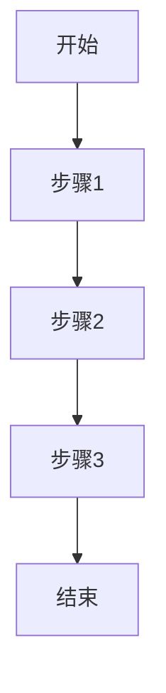

# 产品业务分析

**代码分支信息**
- 分支名称：[current_branch]
- 开发提示：请在此分支上进行开发
---

## 一、背景与现状

### 1.1 业务背景
- **业务领域**: [根据TFS需求自动识别产品条线和业务领域]
- **业务痛点**: [描述当前存在的问题或痛点]
- **业务价值**: [描述需求带来的业务价值]

### 1.2 现状分析
- **当前实现**: [描述当前系统是如何处理的]
- **存在问题**: [列出当前存在的问题]
- **用户反馈**: [如有用户反馈，在此说明]

---

## 二、需求分析

### 2.1 需求概述
- **需求来源**: [TFS需求号]
- **需求类型**: [新增功能/功能增强/Bug修复/移植需求]

### 2.2 需求详情
- **功能描述**: [详细描述需求的功能]
- **业务规则**: [列出所有业务规则]
- **数据来源**: [说明数据从哪里来]
- **数据去向**: [说明数据到哪里去]

### 2.3 用户输入与数据库代码映射表

> ⚠️ **重要**: 这是最容易遗漏的部分！

| 用户填写/选择 | 数据库代码 | 概念域/术语表 | 校验规则 | 错误提示 |
|-------------|-----------|-------------|---------|---------|
| [示例: "是"] | [示例: 98360] | [示例: 开关形式授权] | [示例: 只接受"是"或"否"] | [示例: 只能填写"是"或"否"] |
| ... | ... | ... | ... | ... |

### 2.4 空值处理规则

| 字段名称 | 是否必填 | 空值处理 | 说明 |
|---------|---------|---------|------|
| [字段1] | [是/否] | [保持原值/清空/报错] | [说明] |
| ... | ... | ... | ... |

---

## 三、业务分析

### 3.1 业务流程分析

#### 业务流程图


#### 流程说明
1. **步骤1**: [详细说明]
2. **步骤2**: [详细说明]
3. **步骤3**: [详细说明]

### 3.2 业务规则详解

#### 规则1: [规则名称]
- **规则描述**: [详细描述]
- **触发条件**: [何时触发]
- **处理逻辑**: [如何处理]
- **异常处理**: [异常情况如何处理]

#### 规则2: [规则名称]
...

### 3.3 数据权限与范围

#### 数据权限矩阵

| 角色/科室 | 院区 | 数据范围 | 操作权限 |
|----------|------|---------|---------|
| [角色1] | [院区] | [全部/本科室/个人] | [查看/编辑/删除] |
| ... | ... | ... | ... |

#### 并发控制策略
- **并发场景**: [描述可能的并发场景]
- **控制策略**: [锁/队列/乐观锁等]
- **冲突处理**: [如何处理冲突]

---

## 四、用户体验分析

### 4.1 操作界面设计

#### 界面布局
- **界面类型**: [列表/表单/详情/弹窗]
- **主要元素**: [列出主要界面元素]
- **交互方式**: [点击/选择/拖拽等]

#### 操作流程
1. **第一步**: [用户操作]
2. **第二步**: [系统响应]
3. **第三步**: [用户操作]

### 4.2 错误提示规范

#### 错误提示模板
```
[上下文] + [具体错误] + [正确示例]
```

#### 常见错误场景

| 错误场景 | 错误提示 | 解决方案 |
|---------|---------|---------|
| [场景1] | [提示文案] | [如何解决] |
| ... | ... | ... |

**示例**:
- ✅ **好的错误提示**:
  ```
  技术[腹腔镜手术]（分类：限制类技术）授权值处理失败：
  开关形式授权值只能填写'是'或'否'，当前值：YES
  ```
- ❌ **差的错误提示**:
  ```
  数据格式错误
  ```

### 4.3 界面原型设计（条件）

> ⚠️ **说明**: 本章节仅在进行原型设计时填写。如果本需求未涉及原型设计，请删除本章节。

#### 4.3.1 原型文件引用

**原型存储路径**:
```
/analysis.result/{需求号}-原型设计/
├── {页面1名称}.html
├── {页面2名称}.html
└── README.md（原型说明文档）
```

**原型文件清单**:

| 原型文件 | 页面类型 | 主要功能 | 对应业务流程 |
|---------|---------|---------|-------------|
| [login.html] | [登录页] | [用户登录] | [用户登录流程] |
| [form.html] | [表单页] | [数据录入] | [数据提交流程] |
| ... | ... | ... | ... |

#### 4.3.2 原型设计说明

**设计规范**:
- **组件库**: WinDesign Next（Vue 3.3+）
- **技术栈**: 单页HTML，可在浏览器中直接运行
- **设计风格**: 符合WinDesign Next设计规范

**关键交互流程**:
1. **流程1**: [详细说明原型的关键交互流程]
   - [用户操作步骤1]
   - [系统响应步骤2]
   - [与业务流程的对应关系]

2. **流程2**: [如果有多个关键流程，继续说明]

**页面跳转关系**:


#### 4.3.3 原型与业务流程对应关系

| 业务流程步骤 | 对应原型页面 | 关键交互 | 数据流转 |
|-------------|-------------|---------|---------|
| [步骤1] | [页面1] | [交互说明] | [数据说明] |
| [步骤2] | [页面2] | [交互说明] | [数据说明] |
| ... | ... | ... | ... |

---

## 五、参数配置分析

### 5.1 涉及的系统参数

| 参数编码 | 参数名称 | 默认值 | 参数类型 | 影响说明 |
|---------|---------|--------|---------|---------|
| [PARAM_XXX] | [参数名称] | [默认值] | [COMMON/WF/QUALITY] | [说明参数如何影响功能] |
| ... | ... | ... | ... | ... |

### 5.2 参数控制逻辑

- **参数检查时机**: [何时检查参数]
- **参数生效方式**: [立即生效/下次登录/重启服务]
- **参数验证规则**: [如何验证参数值]

---

## 附录

### A. 需求澄清记录 ⭐可选

> ⚠️ **说明**：本章节仅在存在待澄清问题且产品经理已补充时填写。如无待澄清问题，删除本章节。

**分析时间**：YYYY-MM-DD
**澄清人员**：产品经理

#### A.1 澄清问题及补充内容

**问题1：[问题类型] - [问题标题]**

**原始问题描述**：
[分析过程中发现的问题描述]

**补充内容**：
[产品经理提供的补充内容]

**补充时间**：YYYY-MM-DD
**补充人员**：产品经理

---

**问题2：[问题类型] - [问题标题]**

**原始问题描述**：
[分析过程中发现的问题描述]

**补充内容**：
[产品经理提供的补充内容]

**补充时间**：YYYY-MM-DD
**补充人员**：产品经理

---

#### A.2 澄清影响说明

本次澄清对需求分析的影响：
- [影响说明1]
- [影响说明2]

基于补充内容，已更新以下章节：
- [已更新的章节1]
- [已更新的章节2]

#### A.3 无待澄清问题说明

如本需求分析过程中未发现待澄清问题，在此说明：
```
本需求分析过程中，未发现需要向产品经理澄清的问题。需求描述清晰，业务规则明确，可继续进行代码实现分析。
```

---

 