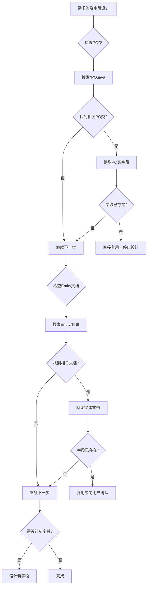

# 代码搜索指南

## 搜索策略

### 1. 需求分析前的代码验证（Rule 6）
**最终权威**：代码搜索结果优于文档说明

在开始任何需求分析之前，必须先验证代码中是否已存在该功能：
- 许多需求是移植需求（从历史分支移植）
- 功能可能已经通过参数配置实现
- 避免重复分析已实现的功能

### 2. 前后端代码搜索范围

#### 后端代码搜索路径
```
Code/（动态检测实际内容）
├── 使用 `ls -la Code/` 查看实际目录结构
├── 搜索所有winning-business-*目录（业务逻辑层）
└── 根据实际存在的模块进行搜索
```

#### 前端代码搜索路径
```
Code/（动态检测实际内容）
├── 使用 `ls -la Code/` 查看实际目录结构
├── 搜索所有winning-webui-*目录（前端应用）
└── 根据实际存在的前端项目进行搜索
```

### 3. 搜索关键词选择

#### 使用中文业务术语
- ✅ "医疗组"、"手术权限"、"抗菌药物审批"
- ❌ "medicalTeam"、"surgeryPermission"（除非确定代码使用英文）

#### 结合业务场景搜索
- 功能名称 + "Controller" / "Service" / "component"
- 参数名称（从 /param 目录获取）
- 表单字段名称（从需求描述中提取）

### 4. Grep 工具使用技巧

#### 基本搜索模式
```bash
# 搜索文件内容（优先使用）
rg "医疗组" --type java
rg "手术权限" --type vue

# 搜索文件名
find . -name "*医疗组*"
find . -name "*SurgeryPermission*"
```

#### 上下文搜索
```bash
# 查看匹配行的上下文
rg "抗菌药物" -C 3

# 只显示文件名
rg "用血申请" -l
```

### 5. 代码搜索检查点

#### 分析前检查清单
- [ ] 是否已在后端业务逻辑层搜索？
- [ ] 是否已在前端组件中搜索？
- [ ] 是否已搜索相关配置参数？
- [ ] 是否已检查参数文档中的相关参数？

#### 发现已实现功能的处理
如果发现代码中已存在该需求的功能：
1. **立即停止分析**
2. 记录代码位置：
   - 文件路径和行号
   - 类名/组件名
   - 关键方法/函数
3. 向用户报告：
   - "需求XXX已在以下代码位置实现："
   - 提供代码引用
   - 说明是否需要参数配置

### 6. 实体字段验证 ⭐新增强制约束

**核心原则**：在设计新字段前，必须先验证PO类和Entity文档中是否已存在

#### 6.1 PO类字段检查（强制）
```
⚠️ 在设计任何新字段之前，必须执行以下检查：

步骤1：搜索相关PO类
- 使用 Glob 工具搜索：**/*PO.java
- 使用 Grep 工具搜索：class.*PO.*extends

步骤2：阅读PO类字段定义
- 读取相关PO类文件
- 查找是否已存在相同或相似的字段
- 记录字段名称、类型、注释

步骤3：比对需求字段
- 需求中的字段名 vs PO类中的字段名
- 需求中的字段用途 vs PO类字段的业务含义
- 需求中的数据类型 vs PO类字段的数据类型

步骤4：确认是否需要新字段
- 如果PO类中已存在 → 直接使用，在分析中说明复用关系
- 如果PO类中不存在 → 确认后设计新字段
- 如果不确定 → 向用户确认
```

#### 6.2 Entity文档检查（强制）
```
⚠️ 在设计任何新字段之前，必须执行以下检查：

步骤1：检查/Entity/目录
- 使用 Bash 命令：ls -la Entity/
- 查找相关的实体定义文档

步骤2：阅读实体文档
- 搜索与需求相关的实体表
- 记录已有字段定义
- 理解字段的业务含义

步骤3：比对与确认
- 需求字段 vs Entity文档字段
- 发现已有字段 → 直接复用
- 发现相似字段 → 向用户确认是否可复用
- 无相关字段 → 设计新字段
```

#### 6.3 字段检查决策流程


#### 6.4 强制检查清单
在设计任何新字段时，必须完成以下检查：
- [ ] 已搜索相关PO类（*PO.java）
- [ ] 已阅读PO类中的字段定义
- [ ] 已检查/Entity/目录下的实体文档
- [ ] 已确认字段不存在于PO类中
- [ ] 已确认字段不存在于Entity文档中
- [ ] 如存在相似字段，已向用户确认

---

### 7. 参数配置验证 ⭐增强强制约束

#### 7.1 参数文档检查（强制）
```
⚠️ 在设计任何新参数之前，必须执行以下检查：

步骤1：检查/Param/目录
- 使用 Bash 命令：ls -la Param/
- 查找相关的参数配置文档

步骤2：搜索参数文档
- 搜索与需求相关的参数
- 记录参数编码、参数名称、参数说明
- 理解参数的业务含义

步骤3：比对与确认
- 需求功能 vs 现有参数功能
- 发现已有参数 → 直接复用
- 发现相似参数 → 向用户确认是否可复用
- 无相关参数 → 设计新参数
```

#### 7.2 参数搜索优先级（原内容）
1. 查看 `Param/` 目录下的配置参数文档
2. 在代码中搜索参数使用情况
3. 验证参数是否已实现需求功能

#### 7.3 参数类型说明
- **COMMON**（113个）：通用功能参数
- **WF**（22个）：工作流相关参数
- **QUALITY**（8个）：质量控制参数
- **HOSPITAL**（8个）：医院级别参数

### 7. 代码与文档冲突处理

#### 处理原则（Rule 8）
**以代码为准**：如果代码实现与文档（Param/、Knowledge/）冲突：

1. 优先信任代码实现
2. 记录冲突点
3. 向用户确认后再继续工作

示例：
```
发现冲突：
- 文档说明：参数 PARAM_A 控制功能X
- 代码实现：参数 PARAM_A 未被使用
- 处理：向用户确认哪个是正确的
```

## 常见搜索场景

### 场景1：新功能需求
搜索关键词 → 未找到 → 进行需求分析

### 场景2：参数配置需求
搜索参数 → 验证代码 → 已实现 → 停止分析

### 场景3：移植需求
搜索历史分支 → 发现已有实现 → 分析移植方案

### 场景4：功能增强需求
搜索现有实现 → 了解架构 → 设计兼容方案

## 搜索工具命令参考

```bash
# 使用 Grep 工具（推荐）
Grep("医疗组", path="Code/", type="java")
Grep("手术权限", path="Code/", type="vue")

# 使用 Glob 工具（查找文件）
Glob("*.java", "Code/")
Glob("*.vue", "Code/")

# 使用 Read 工具（读取文件）
Read("Code/xxx/xxx.java")
Read("Code/xxx.vue")
```

**注意**：Code/目录的实际内容需要通过 `ls -la Code/` 动态检测

## 注意事项

1. **不能改动任何源代码**（Rule 9）
2. **必须前后端都搜索**（Rule 4）
3. **发现已实现功能必须立即停止**（Rule 6）
4. **代码与文档冲突以代码为准**（Rule 8）
5. **设计新字段前必须检查PO类和Entity文档**（Rule 10）⭐新增
6. **设计新参数前必须检查Param文档**（Rule 11）⭐新增
