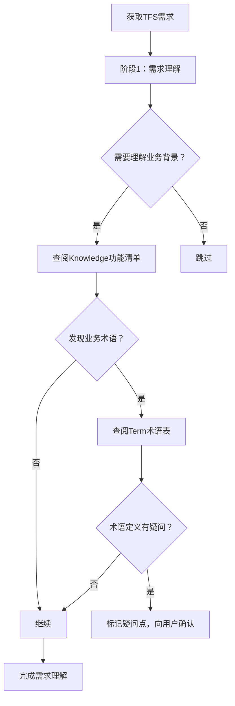
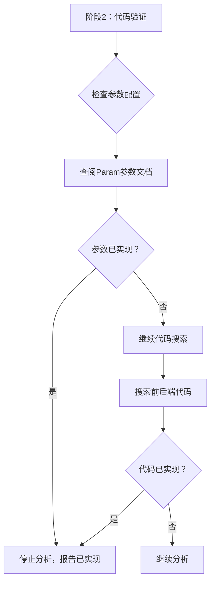
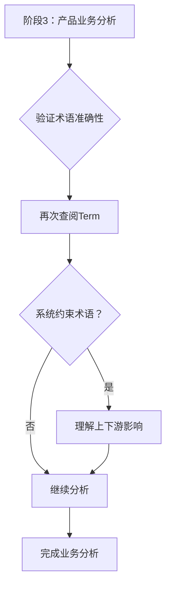
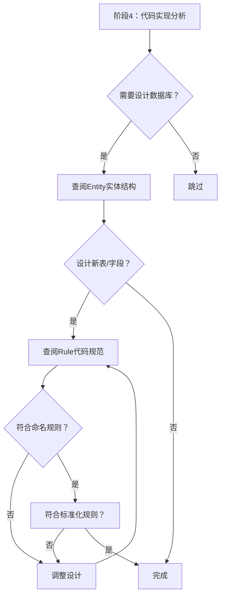

# 知识管理与整合指南

本指南提供需求分析过程中知识文件的系统化使用方法，包括5大知识目录的检索规则、验证规则和更新机制。

---

## 1. 知识目录概览

### 1.1 目录结构（拼写规范修正）

**重要**：知识目录的正确拼写为 `/Knowledge/`，而非 `/Konwledge/`（错误拼写）

```
项目根目录/
├── Knowledge/ → 根据TFS需求智能识别的功能清单 ✅ 正确拼写
├── Param/ → 使用者放入的配置参数文档
├── Entity/ → 使用者放入的实体和字段定义
├── Term/ → 使用者放入的术语概念域映射
└── Rule/ → 使用者放入的代码规范和命名规则
```

**拼写修正历史**：
- ❌ 错误：`/Konwledge/`
- ✅ 正确：`/Knowledge/`
- 📍 影响文件：SKILL.md、readme.md

### 1.2 知识文件统计

**重要说明**：
- **Knowledge/**：根据TFS需求智能识别对应产品模块的功能清单
- **Param/、Entity/、Term/、Rule/**：使用者将自己负责的产品线相关文件放入对应目录

| 知识目录 | 文件内容 | 主要用途 | 维护责任人 |
|---------|---------|---------|-----------|
| Knowledge/ | 根据需求智能识别的功能清单文件 | 理解业务背景，确定产品类型 | 产品经理 |
| Param/ | 使用者放入的配置参数文档 | 参数复用检查，避免重复开发 | 系统架构师 |
| Entity/ | 使用者放入的实体和字段定义 | 数据库设计参考，了解数据结构 | 数据库设计师 |
| Term/ | 使用者放入的术语概念域映射 | 验证术语准确性，特别是系统约束术语 | 业务分析师 |
| Rule/ | 使用者放入的代码规范和命名规则 | 确保新表/字段设计符合规范 | 技术负责人 |

**知识文件准备指南**：
- **Knowledge/**：技能包根据TFS需求的"产品名称"、"迭代路径"、"区域路径"智能识别，无需手动筛选
- **其他目录**：使用者将自己负责的产品线相关文件放入对应目录
- 无关文件不纳入技能包分析范围
- 建议定期更新知识文件，保持与产品版本同步

---

## 2. 知识文件详解

### 2.1 Knowledge/ - 业务功能清单

**用途**：理解业务背景，确定产品类型

**路径**：`Knowledge/` （根据TFS需求智能识别功能清单）

**识别方法**：
1. 从TFS需求的"产品名称"、"迭代路径"、"区域路径"自动识别产品类型
2. 根据产品类型匹配Knowledge/目录下对应的功能清单文件
3. 只读取与当前需求相关的功能清单，缩小文件范围

**使用方法**：
1. 获取TFS需求，分析产品类型（临床产品/医辅产品/病案病历产品/医管产品）
2. 智能匹配Knowledge/目录下对应产品功能清单
3. 理解现有功能范围和边界
4. 判断需求是新增功能还是变更现有功能

**示例**：
```markdown
需求：抗菌药物审批流程优化
↓
产品类型：医管产品
↓
读取：Knowledge/目录下医管相关功能清单
↓
了解：现有审批流程的功能范围、相关功能模块
↓
判断：是新增功能还是优化现有功能
```

**关键价值**：
- 快速了解业务背景
- 避免重复分析已存在功能
- 理解功能间的依赖关系

---

### 2.2 Param/ - 配置参数文档

**用途**：参数复用检查，避免重复开发

**路径**：`Param/` （读取目录下所有文件）

**使用方法**：
1. 提取需求中的关键词（如"审批"、"权限"、"控制"等）
2. 搜索Param/目录下参数文档中的相关参数
3. 发现匹配参数 → 优先复用，避免重复开发
4. 无匹配参数 → 考虑新增参数，但要说明理由

**关键原则**：
- **优先复用现有参数**（Rule 1：兼容性原则）
- **代码实现优先于文档说明**（Rule 8：以代码为准）
- 发现参数冲突时，要向用户确认

**示例**：
```markdown
需求：启用抗菌药物会诊功能
↓
查阅：Param/目录下的参数文档
↓
发现：ANTIBIOTIC_CONSULTATION_ENABLED 参数
↓
结果：功能已通过参数控制，无需重复开发
```

---

### 2.3 Entity/ - 实体属性明细

**用途**：数据库设计参考，了解数据结构

**路径**：`Entity/` （读取目录下所有文件）

**使用方法**：
1. 识别需求涉及的实体（如"审批记录"、"医师档案"等）
2. 查询Entity/目录下实体文档，了解现有表结构
3. 参考字段定义、命名规范、数据类型
4. 设计新表/新字段时，保持与现有实体的一致性

**关键价值**：
- 了解现有数据模型
- 保持命名和设计一致性
- 避免重复创建实体

**示例**：
```markdown
需求：新增抗菌药物会诊记录
↓
查阅：Entity/目录下的实体文档
↓
搜索：关键词"会诊"、"审批"
↓
参考：类似实体 CONSULTATION_RECORD、APPROVAL_RECORD
↓
设计：新实体 ANTIBIOTIC_CONSULTATION，参考现有实体的字段设计
```

---

### 2.4 Term/ - 术语概念域映射

**用途**：验证术语准确性，特别是系统约束术语

**路径**：`Term/` （读取目录下所有文件）

**内容结构**：
- 按业务领域分类（基础术语、医疗技术管理、手术权限管理、医务审批流程等）
- 术语字段：概念域ID、概念域名称、说明、代码位置等
- 包含医学术语和**系统特定约束术语**（串联上下游业务）

**使用方法**：
1. 发现需求中的业务术语
2. 查阅术语表验证定义
3. 发现术语冲突或描述错误 → 主动指出
4. 特别注意：系统约束术语（串联上下游业务的术语）

**关键价值**：
- 确保术语使用准确
- 发现需求描述错误
- 理解术语的业务影响

**真实案例**：
```markdown
需求描述：QID执行时间8-12-18
↓
查阅：Term/目录下的术语概念域映射文档
↓
发现：QID（Quater in Die）定义为"每天4次执行"
↓
冲突：需求描述"8-12-18"（每天3次）与QID定义冲突
↓
结果：主动指出需求描述错误，向用户确认
```

**特别注意**：系统约束术语
- 系统约束术语串联上下游业务
- 修改这些术语可能影响多个功能模块
- 示例：审批状态、用血等级、手术权限等级等

---

### 2.5 Rule/ - 代码规范

**用途**：确保新表/字段设计符合命名规范

**路径**：`Rule/` （读取目录下所有文件）

**内容结构**：
- **I型命名规则**：标识、标志
- **II型命名规则**：排序序号、代码、状态、类别、分类、类型
- **III型命名规则**：Code、DateTime、Time、Date
- **IV型命名规则**：编号、价格、金额、URL、JSON、DATA
- **其它命名规则**：实体标识属性命名
- **标准化规则**：Code类型必须引用标准数据元和值域

**使用方法**：
1. 设计新表/新字段时
2. 查阅代码规范，验证命名是否符合规则
3. 验证数据类型是否符合规范
4. 验证Code类型是否符合标准化规则

**关键规则示例**：

**I型命名规则**：
- 标识：中文名称结尾为"标识"，英文名称结尾为"_ID"，数据类型为Identifier
- 标志：中文名称结尾为"标志"，英文名称结尾为"_FLAG"，数据类型为Flag

**II型命名规则**：
- 状态：中文名称结尾为"状态"，英文名称结尾为"_STATUS"，数据类型为Status
- 类型：中文名称结尾为"类型"，英文名称结尾为"_TYPE"，数据类型为Code

**标准化规则**：
- 数据类型为Code的字段，必须引用标准数据元，必须绑定标准值域

**示例**：
```markdown
设计：审批状态字段
↓
查阅：Rule/目录下的代码规范文档
↓
验证：符合II型命名规则
- 中文名称：XX审批状态 ✓
- 英文名称：XX_APPROVAL_STATUS ✓
- 数据类型：Status ✓
↓
如果数据类型是Code：
- 必须引用标准数据元 ✓
- 必须绑定标准值域 ✓
```

---

## 3. 知识检索决策树

### 3.1 阶段1：需求获取与理解



**检索规则**：
1. **优先查阅Knowledge**：了解业务背景和现有功能
2. **发现术语查阅Term**：验证术语定义准确性
3. **主动指出冲突**：发现术语冲突或描述错误时主动指出

---

### 3.2 阶段2：代码验证



**检索规则**：
1. **优先查阅Param**：检查是否可通过参数实现
2. **代码搜索验证**：前后端代码都要搜索（Rule 4）
3. **发现已实现立即停止**：避免重复分析（Rule 6）

---

### 3.3 阶段3：产品业务分析



**检索规则**：
1. **再次查阅Term**：验证业务术语准确性
2. **特别注意系统约束术语**：理解上下游业务影响
3. **质疑可疑描述**：验证医学定义准确性

---

### 3.4 阶段4：代码实现分析



**检索规则**：
1. **查阅Entity**：了解现有实体结构，参考设计
2. **查阅Rule**：验证命名规则和标准化规则
3. **符合规范**：确保设计符合I/II/III/IV型命名规则

---

## 4. 使用场景映射表

| 知识目录 | 主要用途 | 维护责任人 |
|---------|---------|-----------|
| **Knowledge** | 阶段1 | 根据TFS需求智能识别功能清单 | 理解业务背景，确定产品类型 |
| **Param** | 阶段1 + 阶段2 | 使用者放入的参数文档 | 理解现有配置，验证功能是否已通过参数实现 |
| **Term** | 阶段1 + 阶段3 | 使用者放入的术语定义和概念域 | 理解业务术语，验证需求描述准确性，特别是系统约束术语 |
| **Entity** | 阶段4 | 使用者放入的实体结构和表定义 | 为数据库设计提供参考，保持设计一致性 |
| **Rule** | 阶段4 | 使用者放入的代码规范和命名规则 | 确保新表/字段设计符合命名规范和标准化规则 |

---

## 5. 知识验证规则

### 5.1 术语验证

**验证目的**：确保需求中的术语使用准确，发现描述错误

**验证流程**：
1. 发现需求中的业务术语
2. 查阅Term术语表验证定义
3. 发现冲突时主动指出
4. 特别注意系统约束术语

**常见冲突类型**：
- 医学术语定义错误（如QID执行时间）
- 系统约束术语使用不当
- 术语与实际业务逻辑不符

**处理方式**：
- 向用户确认
- 以术语表定义为准
- 记录冲突点

---

### 5.2 参数验证

**验证目的**：优先复用现有参数，避免重复开发

**验证流程**：
1. 提取需求关键词
2. 搜索Param参数文档
3. 发现匹配参数 → 验证是否可实现需求
4. 代码实现优先于文档说明（Rule 8）

**验证原则**：
- 优先复用现有参数（Rule 1：兼容性原则）
- 发现参数冲突时向用户确认
- 以代码实现为准

---

### 5.3 命名验证

**验证目的**：确保新表/字段设计符合命名规范

**验证流程**：
1. 设计新表/新字段
2. 查阅Rule代码规范
3. 验证是否符合I/II/III/IV型命名规则
4. 验证Code类型是否符合标准化规则

**验证要点**：
- 中文名称结尾是否符合规则
- 英文名称结尾是否符合规则
- 数据类型是否符合规则
- Code类型是否引用标准数据元和值域

---

### 5.4 冲突处理原则

**核心原则**：代码与文档冲突时，以代码为准（Rule 8）

**冲突类型**：
1. 代码实现 vs Param文档
2. 代码实现 vs Knowledge文档
3. 代码实现 vs Term定义

**处理流程**：
1. 发现冲突
2. 向用户确认
3. 以代码为准
4. 记录冲突点

**重要说明**：
- 不能自行决定
- 必须向用户确认
- 记录冲突点和决策

---

## 6. 知识文件质量控制

### 6.1 维护责任人

| 知识目录 | 维护责任人 | 主要职责 |
|---------|-----------|---------|
| Knowledge/ | 产品经理 | 功能清单更新、版本管理 |
| Param/ | 系统架构师 | 参数定义更新、参数说明 |
| Entity/ | 数据库设计师 | 实体定义更新、表结构说明 |
| Term/ | 业务分析师 | 术语定义更新、概念域维护 |
| Rule/ | 技术负责人 | 代码规范更新、命名规则 |

---

### 6.2 更新频率

| 知识目录 | 更新触发条件 | 更新频率 |
|---------|-------------|---------|
| Knowledge/ | 版本发布、功能变更 | 每版本发布后 |
| Param/ | 参数变更、新增参数 | 参数变更时 |
| Entity/ | 数据库变更、新增实体 | 数据库变更时 |
| Term/ | 新术语定义、术语变更 | 新术语定义时 |
| Rule/ | 规范变更、新增规则 | 规范变更时 |

---

### 6.3 质量检查点

**文档格式正确性**：
- Markdown格式规范
- 表格格式正确
- 超链接有效

**内容完整性**：
- 必填字段完整
- 说明清晰准确
- 版本信息完整

**与代码一致性**：
- Param与代码实现一致
- Entity与数据库结构一致
- Term与实际业务一致

**版本信息更新**：
- 更新时间记录
- 更新内容说明
- 维护人记录

---

## 7. 附录：快速参考

### 7.1 常见业务领域

1. **医疗组织管理**：医疗组、专家委员会、科室管理
2. **医疗授权与权限管理**：医师权限、手术权限、抗菌药物权限
3. **医疗质量管理**：质量控制、审批流程、病历质量
4. **医疗事务管理**：医师档案、排班管理、考核管理
5. **审批中心**：抗菌药物审批、用血审批、手术审批
6. **首页与台账**：工作台首页、患者追踪、台账管理
7. **病案与病历管理**：病案管理、病历书写、病案统计
8. **手术与麻醉管理**：手术安排、麻醉管理、日间手术
9. **康复与护理管理**：康复评估、护理记录、医嘱执行
10. **院感与单病种管理**：院感监测、单病种管理、临床路径

---

### 7.2 产品条线分类

| 产品条线 | 特点 | 重点关注 |
|---------|------|---------|
| **临床产品** | 用户体验、操作效率 | 医嘱、处方、病历、患者就诊 |
| **医辅产品** | 辅助诊疗、资源调度 | 手术、麻醉、康复、日间手术 |
| **病案病历产品** | 病历质量、病案规范 | 病案首页、疾病编码、DRGs |
| **医管产品** | 流程规范、权限控制 | 医疗组、权限管理、质控、审批 |

---

### 7.3 参数类型分布

| 参数类型 | 数量说明 | 说明 |
|---------|---------|------|
| COMMON | 通用参数 | 适用于全院 |
| WF | 工作流参数 | 控制审批流程 |
| QUALITY | 质控参数 | 质量控制相关 |
| HOSPITAL | 医院级参数 | 医院特定配置 |

**注意**：参数类型和数量因产品而异，以上为常见类型示例。

---

### 7.4 关键规则速查

| 规则 | 内容 | 优先级 |
|------|------|-------|
| **Rule 1** | 兼容性原则：不能直接改写原逻辑 | ⭐⭐⭐⭐⭐ |
| **Rule 4** | 前后端代码都要扫描 | ⭐⭐⭐⭐ |
| **Rule 5** | 理解需求中的图片 | ⭐⭐⭐ |
| **Rule 6** | 代码搜索优先（最终权威） | ⭐⭐⭐⭐⭐ |
| **Rule 7** | 前置/参见需求处理 | ⭐⭐⭐⭐ |
| **Rule 8** | 以代码为准 | ⭐⭐⭐⭐⭐ |
| **Rule 9** | 不能改代码 | ⭐⭐⭐⭐⭐ |
| **Rule 10** | 实体字段检查：设计新字段前必须检查PO类和Entity文档 | ⭐⭐⭐⭐⭐ |
| **Rule 11** | 参数配置检查：设计新参数前必须检查Param文档 | ⭐⭐⭐⭐⭐ |

---

## 8. 知识更新机制（⭐重要）

### 8.1 更新时机：需求分析全流程完成后

**正确的流程顺序**：
```
阶段1：需求获取与理解
     ↓
阶段2：代码验证
     ↓
阶段3：产品业务分析
     ↓
阶段4：代码实现分析
     ↓
阶段5：文档上传到TFS ⭐
     ↓
知识更新评估
     ↓
{是否需要更新知识库？}
     ↓
  是 → 更新Knowledge功能清单
  否 → 结束
```

**重要说明**：
- 知识更新评估在**TFS上传之后**进行
- 基于完整的分析结果（业务分析+代码实现分析）
- 确保需求分析全流程已完成
- 不影响需求分析主流程

---

### 8.2 需要更新Knowledge的情况

**情况1：新增功能模块**
- 需求实现了全新的功能模块
- 该功能模块在现有功能清单中不存在
- → 需要在Knowledge中新增功能清单条目

**情况2：功能重大变更**
- 需求对现有功能进行了重大变更
- 功能范围、流程、逻辑发生显著变化
- → 需要在Knowledge中更新功能清单描述

**情况3：功能新增/下线**
- 需求新增了子功能
- 需求下线了已有功能
- → 需要在Knowledge中更新功能状态

**情况4：参数配置新增**
- 需求分析发现需要新增配置参数
- 该参数控制新的业务行为
- → 需要在Knowledge中记录参数说明
- → 需要在Param中新增参数定义

**情况5：实体结构新增**
- 需求需要新增实体或字段
- → 需要在Entity中记录实体定义
- → 需要在Term中记录相关术语（如适用）

---

### 8.3 不需要更新Knowledge的情况

**情况1：纯技术优化**
- 需求仅涉及技术实现优化
- 业务功能无变化
- → 不更新Knowledge

**情况2：Bug修复**
- 需求仅修复程序缺陷
- 功能逻辑无变化
- → 不更新Knowledge

**情况3：移植需求**
- 需求是将已有功能移植到其他环境
- 功能本身无变化
- → 不更新Knowledge（但需要在分析中说明移植关系）

**情况4：参数调整**
- 需求仅调整现有参数的值
- 参数定义无变化
- → 不更新Knowledge

---

### 8.4 知识更新执行流程

**步骤1：识别更新需求**

在完成需求分析后，评估以下问题：

```markdown
## 需求分析结论

### 新增功能
- [ ] 功能模块：XXX
- [ ] 功能描述：XXX
- [ ] 上线版本：XXX

### 功能变更
- [ ] 原功能：XXX
- [ ] 变更内容：XXX
- [ ] 变更原因：XXX

### 参数新增
- [ ] 参数编码：XXX
- [ ] 参数名称：XXX
- [ ] 参数说明：XXX

### 实体新增
- [ ] 实体表名：XXX
- [ ] 实体中文名：XXX
- [ ] 字段定义：XXX
```

**步骤2：更新知识文件**

**更新Knowledge功能清单**：
```markdown
## 在对应功能清单文件中新增/更新条目

| 功能名称 | 功能描述 | 上线版本 | 备注 |
|---------|---------|---------|------|
| 新功能XXX | 功能详细描述 | V2.1.0 | 需求号XXXXXX |
```

**更新Param参数文档**：
```markdown
## 在参数文档中新增参数

| 序号 | 参数编码 | 参数类型 | 参数名称 | 参数说明 | 参数内容 | 相关功能说明 |
|-----|---------|---------|---------|---------|---------|------------|
| 177 | NEW_PARAM_XXX | COMMON | XXX参数 | 参数说明 | 参数值 | 需求号XXXXXX |
```

**更新Entity实体文档**：
```markdown
## 在实体文档中新增实体

| 序号 | 主题域 | 模型视图 | 实体表名 | 实体中文名 | 负责人 | 是否生成表 |
|-----|-------|---------|---------|-----------|-------|-----------|
| 631 | XXX | XXX | NEW_TABLE_XXX | XXX实体 | XXX | 是 |
```

**步骤3：记录更新日志**
```markdown
## 知识更新日志

### YYYY-MM-DD
- 更新人：XXX
- 更新内容：
  - Knowledge：新增XXX功能清单
  - Param：新增XXX参数
  - Entity：新增XXX实体
- 关联需求：XXXXXX
- 审核人：XXX
```

---

### 8.5 知识更新检查清单

**需求分析完成后**：
- [ ] 是否新增功能模块？
- [ ] 是否功能重大变更？
- [ ] 是否功能新增/下线？
- [ ] 是否需要新增参数？
- [ ] 是否需要新增实体？
- [ ] 是否需要更新术语定义？

**如果上述任一为"是"**：
- [ ] 更新Knowledge功能清单
- [ ] 更新Param参数文档（如需要）
- [ ] 更新Entity实体文档（如需要）
- [ ] 更新Term术语表（如需要）
- [ ] 记录更新日志
- [ ] 提交知识库审核

**如果上述全部为"否"**：
- [ ] 在分析文档中说明"无需更新知识库"
- [ ] 继续下一个需求分析

---

### 8.6 知识更新示例

**示例1：新增功能**
```markdown
## 需求1511290分析结果

### 新增功能
- 功能模块：抗菌药物会诊管理
- 功能描述：实现抗菌药物使用会诊申请、审批、记录全流程管理
- 上线版本：V2.2.0

### 知识更新评估
✅ 需要更新Knowledge
→ 在 Knowledge/医管产品_医务审批流程_功能清单.md 中新增：
  | 功能名称 | 功能描述 | 上线版本 | 备注 |
  |---------|---------|---------|------|
  | 抗菌药物会诊管理 | 实现抗菌药物使用会诊申请、审批、记录全流程管理 | V2.2.0 | 需求1511290 |

✅ 需要更新Param
→ 新增参数：ANTIBIOTIC_CONSULTATION_ENABLED（抗菌药物会诊启用标志）

✅ 需要更新Entity
→ 新增实体：ANTIBIOTIC_CONSULTATION（抗菌药物会诊记录表）

✅ 需要更新Term
→ 新增术语：抗菌药物会诊（Antibiotic Consultation）
```

**示例2：纯技术优化（不更新）**
```markdown
## 需求1511291分析结果

### 变更内容
- 优化抗菌药物审批查询性能
- 添加索引、优化SQL
- 业务功能无变化

### 知识更新评估
❌ 无需更新Knowledge
→ 变更仅涉及技术实现优化，业务功能无变化
→ 在分析文档中说明："本次变更不涉及业务功能变更，无需更新知识库"
```

---

### 8.7 知识更新责任人

**执行人**：需求分析人员（AI）

**审核人**：
- Knowledge更新：产品经理
- Param更新：系统架构师
- Entity更新：数据库设计师
- Term更新：业务分析师
- Rule更新：技术负责人

**更新频率**：每个需求分析完成后

**质量控制**：
- 更新内容必须准确
- 格式必须符合规范
- 版本信息必须完整
- 需要审核人确认

---

## 总结

本指南提供了需求分析过程中知识文件的系统化使用方法，包括5大知识目录的检索规则、验证规则和更新机制。通过遵循本指南，可以：

1. ✅ 准确理解业务背景（Knowledge）
2. ✅ 避免重复开发（Param）
3. ✅ 验证术语准确性（Term）
4. ✅ 保持设计一致性（Entity）
5. ✅ 符合命名规范（Rule）
6. ✅ 持续更新知识库

**关键原则**：
- 代码搜索优先（Rule 6）
- 以代码为准（Rule 8）
- 不能改代码（Rule 9）
- **实体字段检查：设计新字段前必须检查PO类和Entity文档（Rule 10）** ⭐新增
- **参数配置检查：设计新参数前必须检查Param文档（Rule 11）** ⭐新增
- 知识更新在TFS上传之后进行

**快速参考**：
- 知识检索决策树 → 见第3章
- 使用场景映射表 → 见第4章
- 知识验证规则 → 见第5章
- 知识更新机制 → 见第8章
