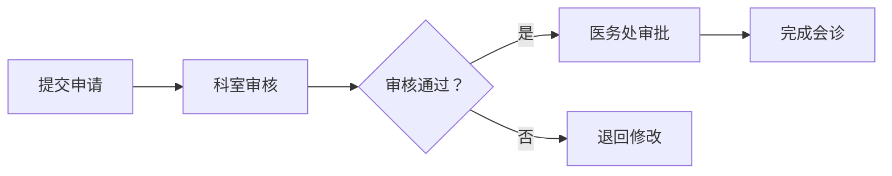

# 原型设计指南

本指南提供需求分析过程中原型设计的完整流程，使用 WinDesign Next 组件库创建高保真HTML原型页面。

---

## 1. 原型设计触发条件

### 1.1 需要原型设计的情况

**满足以下任一条件时，需要进行原型设计**：

| 触发条件 | 说明 | 示例 |
|---------|------|------|
| **新增功能模块** | 无现有功能参考的创新功能 | 全新的会诊管理功能 |
| **特殊功能点** | 交互复杂或逻辑复杂的功能 | 复杂的审批流程、多级联动选择 |
| **创新性功能** | 用户体验要求高的功能 | 智能推荐功能、数据可视化大屏 |
| **可视化功能** | 界面设计要求高的功能 | 报表设计、图表展示、Dashboard |
| **复杂表单** | 字段多、联动关系复杂的表单 | 多级联动表单、动态字段表单 |
| **多角色交互** | 涉及多个用户角色的功能 | 会话、协商、评审类功能 |

### 1.2 不需要原型设计的情况

**以下情况无需原型设计，直接进入阶段4**：

| 不触发条件 | 说明 |
|-----------|------|
| **纯后端逻辑优化** | 不涉及前端界面变更 |
| **简单CRUD功能** | 标准的增删改查功能 |
| **参数配置调整** | 仅修改参数配置的功能 |
| **Bug修复** | 修复现有功能的缺陷 |
| **移植需求** | 功能已存在，仅移植代码 |

---

## 2. 原型设计流程

### 2.1 原型设计准备

**输入材料**：
- 阶段3生成的产品业务分析文档
- 业务流程图
- 用户需求描述
- 界面参考（如有）

**准备工作**：
1. 阅读产品业务分析文档，理解业务需求
2. 确定页面类型（登录页/表单页/列表页/详情页等）
3. 确定交互复杂度
4. 确定需要设计的页面数量

---

### 2.2 调用原型设计技能

**操作步骤**：

```
1. 在需求分析过程中，AI判断需要原型设计
2. AI自动调用 /win-design-next-vue 技能
3. 根据产品业务分析内容进行原型设计
4. 生成高保真HTML原型页面
```

**技能调用时机**：
- 在阶段3.5启动时自动调用
- 基于产品业务分析的内容进行设计
- 支持多轮迭代修改

---

### 2.3 WinDesign Next 组件库使用

**技术栈**：
- Vue 3.3+
- WinDesign Next 组件库（`w-` 前缀）
- TypeScript + `<script setup>` 语法
- CSS 变量（优先）而非 SCSS

**组件选择原则**：

| 页面类型 | 推荐组件 | 说明 |
|---------|---------|------|
| 登录页 | w-form, w-input, w-button, w-checkbox | 表单组件组合 |
| 表单页 | w-form, w-form-item, w-input, w-select, w-date-picker | 完整表单组件 |
| 列表页 | w-table, w-pagination, w-input (搜索) | 表格+分页+搜索 |
| 详情页 | w-descriptions, w-card, w-button | 描述列表+卡片 |
| 审批页 | w-steps, w-form, w-textarea, w-button | 步骤条+表单 |

**组件前缀**：所有组件使用 `w-` 前缀（如 `w-button`, `w-form`）

**CSS类前缀**：渲染的CSS类使用 `.w3-` 前缀（如 `.w3-input`, `.w3-button`）

---

### 2.4 原型页面生成

**输出格式**：
- 格式：HTML（单页面可运行）
- 位置：`/analysis.result/{需求号}-原型设计/{页面名称}.html`
- 特点：高保真、可交互、完整展示

**原型要求**：

1. **高保真**：接近最终界面效果
   - 使用真实的组件样式
   - 模拟真实数据展示
   - 包含交互反馈

2. **可交互**：关键流程可演示
   - 按钮可点击（有反馈）
   - 表单可输入（模拟验证）
   - 标签页可切换

3. **完整性**：包含所有主要功能点
   - 覆盖所有业务场景
   - 包含边界情况处理
   - 显示错误状态提示

4. **可用性**：符合用户体验最佳实践
   - 布局合理，层次清晰
   - 操作流程简单直观
   - 错误提示友好明确

---

## 3. 原型评审与迭代

### 3.1 原型评审流程

```
完成初版原型
     ↓
提交给使用者/业务方评审
     ↓
收集反馈意见
     ↓
{需要修改？}
     ↓
  是 → 修改优化原型 → 更新产品业务分析 → 重新评审
  否 → 原型确认
```

**评审要点**：
- 业务流程是否正确
- 界面布局是否合理
- 交互逻辑是否清晰
- 数据展示是否完整
- 错误处理是否考虑

---

### 3.2 多轮修改的文档同步（⭐重要）

**关键原则**：原型修改后，必须同步更新阶段3的产品业务分析文档

**同步更新机制**：

```markdown
## 文档同步更新流程

### 每轮原型修改后：

1. **记录原型变更**
   - 记录本次迭代的修改内容
   - 记录修改原因和依据
   - 更新版本号

2. **同步更新产品业务分析文档**
   ⭐ 重要：更新 /analysis.result/{需求号}-产品业务分析.md
   - 在"界面原型设计"章节中记录变更
   - 更新相关的业务流程说明
   - 更新用户交互说明

3. **保持一致性检查**
   - 原型设计与业务分析一致
   - 用户输入映射与原型界面一致
   - 业务流程与交互流程一致
```

**文档同步内容示例**：

```markdown
## 产品业务分析文档 - 更新说明

### 界面原型设计章节更新

#### 版本：V1.1

**原型变更记录**：
- V1.0：初版原型
- V1.1：根据评审反馈调整布局，优化表单验证

**原型文件**：
- 文件路径：/analysis.result/{需求号}-原型设计/会诊申请.html
- 原型截图：/analysis.result/{需求号}-原型设计/会诊申请.png

**原型说明**：
1. 页面布局：采用左右分栏布局，左侧为申请表单，右侧为流程状态
2. 交互流程：用户填写表单 → 提交申请 → 审批流程 → 状态更新
3. 关键交互：实时保存、表单验证、进度提示

**与业务流程的对应关系**：
- 原型页面步骤1 → 业务流程"提交申请"
- 原型页面步骤2 → 业务流程"科室审核"
- 原型页面步骤3 → 业务流程"医务处审批"
- 原型页面步骤4 → 业务流程"完成会诊"

**用户输入映射更新**：
- 原型中的"会诊类型" → 业务分析中的"会诊类型代码"
- 原型中的"申请理由" → 业务分析中的"申请原因说明"
- 原型中的"期望时间" → 业务分析中的"期望会诊时间"
```

---

### 3.3 原型确认标准

**满足以下条件时，原型可确认**：

- [ ] 业务流程正确无误
- [ ] 界面布局符合规范
- [ ] 交互逻辑清晰完整
- [ ] 数据展示符合要求
- [ ] 错误处理考虑周全
- [ ] 产品业务分析文档已同步更新
- [ ] 使用者/业务方已确认通过

---

## 4. 原型文件管理

### 4.1 文件组织结构

```
/analysis.result/{需求号}-原型设计/
├── {页面1名称}.html          # 原型HTML文件
├── {页面1名称}.png          # 原型截图（可选）
├── {页面2名称}.html
├── {页面2名称}.png
├── 原型设计说明.md           # 设计说明文档
└── 版本历史.md              # 迭代版本记录
```

### 4.2 版本历史记录

**版本历史.md 模板**：

```markdown
# 原型设计版本历史

## V1.0 - 2026-04-05
**设计内容**：
- 创建初版原型
- 包含3个页面：申请表单、审批流程、详情查看

**修改说明**：
- 初始版本

## V1.1 - 2026-04-06
**设计内容**：
- 优化表单布局
- 增加表单验证提示

**修改说明**：
- 根据业务方反馈，调整表单字段顺序
- 增加必填字段标识
- 优化错误提示显示

**产品业务分析同步更新**：
- 已更新产品业务分析文档中的"界面原型设计"章节
- 已更新用户输入映射表
- 已更新交互流程说明
```

---

## 5. 原型设计完成标志

### 5.1 原型设计完成检查清单

**原型质量检查**：
- [ ] 原型页面已生成（HTML格式）
- [ ] 原型符合WinDesign Next设计规范
- [ ] 原型包含所有主要功能点
- [ ] 原型交互流程完整
- [ ] 原型通过评审确认

**文档同步检查**（⭐最易遗漏）：
- [ ] 产品业务分析文档已更新原型说明
- [ ] 用户输入映射与原型保持一致
- [ ] 业务流程与原型交互保持一致
- [ ] 版本历史记录已更新

**文件管理检查**：
- [ ] 原型文件已保存到指定目录
- [ ] 原型截图已生成（如需要）
- [ ] 版本历史记录已更新

---

## 6. 原型设计示例

### 6.0 可交互HTML原型标准模板 ⭐重要

**⚠️ 问题说明**：
之前的HTML示例存在以下问题，导致生成的原型是静态的、无法交互：
1. 缺少 `#app` 挂载点，导致Vue组件无法正确渲染
2. 缺少 `w-config-provider`，导致组件样式和配置不生效
3. 缺少数据绑定，表单输入无法获取值
4. 事件处理函数没有正确绑定到组件

**✅ 标准模板结构**（必须遵循）：

```html
<!DOCTYPE html>
<html lang="zh-CN">
<head>
    <meta charset="UTF-8">
    <meta name="viewport" content="width=device-width, initial-scale=1.0">
    <title>[页面标题]</title>
    <!-- 1️⃣ WinDesign Next 样式 -->
    <link rel="stylesheet" href="https://unpkg.com/win-design-next/dist/index.css">
    <style>
        /* 2️⃣ 自定义样式 */
        body {
            font-family: -apple-system, BlinkMacSystemFont, 'Segoe UI', Roboto, sans-serif;
            padding: 20px;
            background-color: #f5f5f5;
        }
        .container {
            max-width: 800px;
            margin: 0 auto;
            background: white;
            padding: 24px;
            border-radius: 8px;
            box-shadow: 0 2px 8px rgba(0,0,0,0.1);
        }
        .page-title {
            font-size: 20px;
            font-weight: 600;
            margin-bottom: 24px;
            color: #0052d9;
        }
        .action-buttons {
            display: flex;
            justify-content: flex-end;
            gap: 12px;
            margin-top: 24px;
        }
    </style>
</head>
<body>
    <!-- 3️⃣ Vue挂载点（⭐最关键！必须在body内创建#app） -->
    <div id="app">
        <!-- 4️⃣ WinDesign Next 配置提供者（⭐必需！） -->
        <w-config-provider>
            <div class="container">
                <div class="page-title">{{ pageTitle }}</div>

                <!-- 5️⃣ 表单组件（必须绑定:model和:rules） -->
                <w-form ref="formRef" :model="formData" :rules="rules">
                    <!-- 表单项：v-model绑定数据 -->
                    <w-form-item label="患者姓名" prop="patientName" required>
                        <w-input v-model="formData.patientName" placeholder="请输入患者姓名" />
                    </w-form-item>

                    <w-form-item label="会诊类型" prop="consultationType" required>
                        <w-radio-group v-model="formData.consultationType">
                            <w-radio value="1">普通会诊</w-radio>
                            <w-radio value="2">紧急会诊</w-radio>
                        </w-radio-group>
                    </w-form-item>

                    <w-form-item label="申请理由" prop="reason" required>
                        <w-textarea
                            v-model="formData.reason"
                            placeholder="请详细说明申请会诊的理由"
                            :maxlength="500"
                            :autosize="{ minRows: 3, maxRows: 6 }"
                        />
                    </w-form-item>

                    <!-- 6️⃣ 操作按钮（绑定事件处理函数） -->
                    <div class="action-buttons">
                        <w-button @click="handleCancel">取消</w-button>
                        <w-button theme="primary" @click="handleSubmit">提交申请</w-button>
                    </div>
                </w-form>
            </div>
        </w-config-provider>
    </div>

    <!-- 7️⃣ Vue 3 + WinDesign Next JS -->
    <script src="https://unpkg.com/vue@3/dist/vue.global.js"></script>
    <script src="https://unpkg.com/win-design-next/dist/index.js"></script>
    <script>
        const { createApp, ref, reactive } = Vue;

        createApp({
            setup() {
                // 8️⃣ 响应式数据定义
                const pageTitle = ref('抗菌药物会诊申请');
                const formRef = ref(null);

                // 9️⃣ 表单数据（使用reactive）
                const formData = reactive({
                    patientName: '',
                    consultationType: '1',
                    reason: ''
                });

                // 🔟 表单验证规则
                const rules = {
                    patientName: [
                        { required: true, message: '请输入患者姓名', trigger: 'blur' }
                    ],
                    consultationType: [
                        { required: true, message: '请选择会诊类型', trigger: 'change' }
                    ],
                    reason: [
                        { required: true, message: '请输入申请理由', trigger: 'blur' },
                        { min: 5, max: 500, message: '申请理由长度为5-500个字符', trigger: 'blur' }
                    ]
                };

                // 1️⃣1️⃣ 事件处理函数
                const handleSubmit = () => {
                    // 表单验证
                    formRef.value?.validate((valid) => {
                        if (valid) {
                            console.log('表单数据：', formData);
                            alert('✅ 申请已提交！\n\n数据：' + JSON.stringify(formData, null, 2));
                        } else {
                            alert('❌ 请检查表单填写是否完整');
                        }
                    });
                };

                const handleCancel = () => {
                    // 重置表单
                    formRef.value?.reset();
                    alert('已取消申请');
                };

                // 1️⃣2️⃣ 返回数据到模板
                return {
                    pageTitle,
                    formRef,
                    formData,
                    rules,
                    handleSubmit,
                    handleCancel
                };
            }
        }).mount('#app');  // 1️⃣3️⃣ 挂载到#app（⭐不是body！）
    </script>
</body>
</html>
```

---

### 📋 可交互原型检查清单

生成HTML原型时，必须检查以下13个关键点：

| # | 检查项 | 说明 | 错误示例 |
|---|--------|------|----------|
| 1 | `#app` 挂载点 | 必须有 `<div id="app">` 包裹所有组件 | 缺少会导致组件不渲染 |
| 2 | `w-config-provider` | 必须包裹所有WinDesign组件 | 缺少会导致样式异常 |
| 3 | Vue 3 CDN | `<script src="vue.global.js">` | 使用错误的Vue版本 |
| 4 | WinDesign CSS | `<link rel="stylesheet" href="...index.css">` | 缺少导致无样式 |
| 5 | WinDesign JS | `<script src="...index.js">` | 缺少导致组件不注册 |
| 6 | `:model` 绑定 | `<w-form :model="formData">` | 缺少导致表单无法收集数据 |
| 7 | `:rules` 绑定 | `<w-form :rules="rules">` | 缺少导致无法验证 |
| 8 | `v-model` 绑定 | `<w-input v-model="formData.xxx">` | 缺少导致无法输入 |
| 9 | `prop` 属性 | `<w-form-item prop="xxx">` | 缺少导致验证无法关联 |
| 10 | 事件绑定 | `@click="handleSubmit"` | 缺少导致点击无反应 |
| 11 | `reactive` 数据 | `const formData = reactive({...})` | 使用`ref`会导致嵌套对象问题 |
| 12 | `mount('#app')` | 挂载到`#app`而非`body` | 挂载到`body`可能导致组件渲染异常 |
| 13 | 返回数据 | `return { formData, ... }` | 缺少导致模板无法访问 |

---

### 6.1 表单页原型示例（完整版）

**场景**：抗菌药物会诊申请表单

**⚠️ 重要**：请参考 **6.0 标准模板** 来创建可交互的原型！以下是完整的可运行示例：

```html
<!DOCTYPE html>
<html lang="zh-CN">
<head>
    <meta charset="UTF-8">
    <meta name="viewport" content="width=device-width, initial-scale=1.0">
    <title>抗菌药物会诊申请</title>
    <link rel="stylesheet" href="https://unpkg.com/win-design-next/dist/index.css">
    <style>
        body {
            font-family: -apple-system, BlinkMacSystemFont, 'Segoe UI', Roboto, sans-serif;
            padding: 20px;
            background-color: #f5f5f5;
        }
        .container {
            max-width: 800px;
            margin: 0 auto;
            background: white;
            padding: 24px;
            border-radius: 8px;
            box-shadow: 0 2px 8px rgba(0,0,0,0.1);
        }
        .page-title {
            font-size: 20px;
            font-weight: 600;
            margin-bottom: 24px;
            color: #0052d9;
        }
        .form-section {
            margin-bottom: 24px;
            padding: 16px;
            background-color: #fafafa;
            border-radius: 4px;
        }
        .section-title {
            font-size: 16px;
            font-weight: 500;
            margin-bottom: 16px;
            color: #0052d9;
            padding-bottom: 8px;
            border-bottom: 2px solid #e7e7e7;
        }
        .action-buttons {
            display: flex;
            justify-content: flex-end;
            gap: 12px;
            margin-top: 24px;
        }
    </style>
</head>
<body>
    <div id="app">
        <w-config-provider>
            <div class="container">
                <div class="page-title">抗菌药物会诊申请</div>

                <w-form ref="formRef" :model="formData" :rules="rules">
                    <!-- 基本信息 -->
                    <div class="form-section">
                        <div class="section-title">基本信息</div>
                        <w-form-item label="患者姓名" prop="patientName" required>
                            <w-input v-model="formData.patientName" placeholder="请输入患者姓名" />
                        </w-form-item>
                        <w-form-item label="住院号" prop="hospitalNo" required>
                            <w-input v-model="formData.hospitalNo" placeholder="请输入住院号" />
                        </w-form-item>
                        <w-form-item label="科室" prop="department">
                            <w-select v-model="formData.department" placeholder="请选择科室" clearable>
                                <w-option value="01" label="心内科" />
                                <w-option value="02" label="呼吸科" />
                                <w-option value="03" label="消化科" />
                                <w-option value="04" label="神经科" />
                            </w-select>
                        </w-form-item>
                    </div>

                    <!-- 会诊信息 -->
                    <div class="form-section">
                        <div class="section-title">会诊信息</div>
                        <w-form-item label="会诊类型" prop="consultationType" required>
                            <w-radio-group v-model="formData.consultationType">
                                <w-radio value="1">普通会诊</w-radio>
                                <w-radio value="2">紧急会诊</w-radio>
                            </w-radio-group>
                        </w-form-item>
                        <w-form-item label="申请理由" prop="reason" required>
                            <w-textarea
                                v-model="formData.reason"
                                placeholder="请详细说明申请会诊的理由"
                                :maxlength="500"
                                :autosize="{ minRows: 3, maxRows: 6 }"
                            />
                        </w-form-item>
                        <w-form-item label="期望时间" prop="expectedTime">
                            <w-date-picker
                                v-model="formData.expectedTime"
                                placeholder="请选择期望会诊时间"
                                enable-time-picker
                                format="YYYY-MM-DD HH:mm"
                            />
                        </w-form-item>
                    </div>

                    <!-- 操作按钮 -->
                    <div class="action-buttons">
                        <w-button @click="handleCancel">取消</w-button>
                        <w-button theme="primary" @click="handleSubmit">提交申请</w-button>
                    </div>
                </w-form>
            </div>
        </w-config-provider>
    </div>

    <script src="https://unpkg.com/vue@3/dist/vue.global.js"></script>
    <script src="https://unpkg.com/win-design-next/dist/index.js"></script>
    <script>
        const { createApp, ref, reactive } = Vue;

        createApp({
            setup() {
                const formRef = ref(null);

                const formData = reactive({
                    patientName: '',
                    hospitalNo: '',
                    department: '',
                    consultationType: '1',
                    reason: '',
                    expectedTime: ''
                });

                const rules = {
                    patientName: [
                        { required: true, message: '请输入患者姓名', trigger: 'blur' }
                    ],
                    hospitalNo: [
                        { required: true, message: '请输入住院号', trigger: 'blur' },
                        { pattern: /^ZY\d{9}$/, message: '住院号格式：ZY开头+9位数字', trigger: 'blur' }
                    ],
                    consultationType: [
                        { required: true, message: '请选择会诊类型', trigger: 'change' }
                    ],
                    reason: [
                        { required: true, message: '请输入申请理由', trigger: 'blur' },
                        { min: 5, max: 500, message: '申请理由长度为5-500个字符', trigger: 'blur' }
                    ]
                };

                const handleSubmit = () => {
                    formRef.value?.validate((valid) => {
                        if (valid) {
                            console.log('提交数据：', formData);
                            const typeText = formData.consultationType === '1' ? '普通会诊' : '紧急会诊';
                            alert(`✅ 申请已提交！\n\n患者：${formData.patientName}\n住院号：${formData.hospitalNo}\n会诊类型：${typeText}\n申请理由：${formData.reason}`);
                        } else {
                            alert('❌ 请检查表单填写是否完整正确');
                        }
                    });
                };

                const handleCancel = () => {
                    if (confirm('确认取消申请吗？')) {
                        formRef.value?.reset();
                        alert('已取消申请');
                    }
                };

                return {
                    formRef,
                    formData,
                    rules,
                    handleSubmit,
                    handleCancel
                };
            }
        }).mount('#app');
    </script>
</body>
</html>
```

**关键特性**（全部可交互）：
- ✅ 使用 `#app` 挂载点，组件正确渲染
- ✅ 使用 `w-config-provider` 包裹，样式正确应用
- ✅ 表单数据双向绑定（`v-model`）
- ✅ 表单验证规则（`:rules`）生效
- ✅ 提交按钮可点击，显示输入数据
- ✅ 取消按钮有确认提示
- ✅ 下拉框可选择选项
- ✅ 单选框可切换选择
- ✅ 日期选择器可选择时间

---

### 6.2 列表页原型示例（完整版）

**场景**：会诊申请记录列表

**⚠️ 重要**：请参考 **6.0 标准模板** 来创建可交互的原型！以下是完整的可运行示例：

```html
<!DOCTYPE html>
<html lang="zh-CN">
<head>
    <meta charset="UTF-8">
    <meta name="viewport" content="width=device-width, initial-scale=1.0">
    <title>会诊申请记录</title>
    <link rel="stylesheet" href="https://unpkg.com/win-design-next/dist/index.css">
    <style>
        body {
            font-family: -apple-system, BlinkMacSystemFont, 'Segoe UI', Roboto, sans-serif;
            padding: 20px;
            background-color: #f5f5f5;
        }
        .container {
            max-width: 1400px;
            margin: 0 auto;
            background: white;
            padding: 24px;
            border-radius: 8px;
            box-shadow: 0 2px 8px rgba(0,0,0,0.1);
        }
        .page-header {
            display: flex;
            justify-content: space-between;
            align-items: center;
            margin-bottom: 24px;
        }
        .page-title {
            font-size: 20px;
            font-weight: 600;
            color: #0052d9;
        }
        .search-bar {
            display: flex;
            gap: 12px;
            margin-bottom: 16px;
            align-items: center;
        }
        .search-input {
            flex: 1;
        }
        .table-actions {
            display: flex;
            gap: 8px;
        }
        .status-tag {
            display: inline-block;
            padding: 4px 12px;
            border-radius: 4px;
            font-size: 12px;
        }
        .status-pending {
            background-color: #fff7e6;
            color: #ed7b2f;
        }
        .status-completed {
            background-color: #e8f5e9;
            color: #52c41a;
        }
        .status-rejected {
            background-color: #fff1f0;
            color: #ff4d4f;
        }
    </style>
</head>
<body>
    <div id="app">
        <w-config-provider>
            <div class="container">
                <div class="page-header">
                    <div class="page-title">会诊申请记录</div>
                    <w-button theme="primary" @click="handleCreate">
                        + 新建申请
                    </w-button>
                </div>

                <!-- 搜索栏 -->
                <div class="search-bar">
                    <w-input
                        v-model="searchKeyword"
                        class="search-input"
                        placeholder="搜索患者姓名、住院号"
                        clearable
                        @input="handleSearch"
                    />
                    <w-select v-model="statusFilter" placeholder="状态筛选" style="width: 150px" clearable @change="handleSearch">
                        <w-option value="" label="全部状态" />
                        <w-option value="待审核" label="待审核" />
                        <w-option value="已完成" label="已完成" />
                        <w-option value="已拒绝" label="已拒绝" />
                    </w-select>
                    <w-button theme="primary" @click="handleSearch">搜索</w-button>
                    <w-button @click="handleReset">重置</w-button>
                </div>

                <!-- 数据表格 -->
                <w-table
                    :data="filteredTableData"
                    :row-key="rowKey"
                    stripe
                    border
                    :loading="loading"
                >
                    <w-table-column prop="patientName" label="患者姓名" width="120" />
                    <w-table-column prop="hospitalNo" label="住院号" width="150" />
                    <w-table-column prop="department" label="科室" width="120" />
                    <w-table-column prop="type" label="会诊类型" width="120" />
                    <w-table-column prop="reason" label="申请理由" min-width="200" show-overflow-tooltip />
                    <w-table-column prop="status" label="状态" width="100">
                        <template #default="{ row }">
                            <span :class="['status-tag', getStatusClass(row.status)]">
                                {{ row.status }}
                            </span>
                        </template>
                    </w-table-column>
                    <w-table-column prop="applyTime" label="申请时间" width="180" />
                    <w-table-column label="操作" width="180" fixed="right">
                        <template #default="{ row }">
                            <div class="table-actions">
                                <w-button size="small" @click="handleView(row)">查看</w-button>
                                <w-button
                                    size="small"
                                    :disabled="row.status !== '待审核'"
                                    @click="handleEdit(row)"
                                >编辑</w-button>
                                <w-button
                                    size="small"
                                    theme="danger"
                                    :disabled="row.status === '已完成'"
                                    @click="handleDelete(row)"
                                >删除</w-button>
                            </div>
                        </template>
                    </w-table-column>
                </w-table>

                <!-- 分页 -->
                <div style="margin-top: 16px; display: flex; justify-content: flex-end;">
                    <w-pagination
                        v-model="currentPage"
                        :total="total"
                        :page-size="pageSize"
                        @change="handlePageChange"
                    />
                </div>
            </div>
        </w-config-provider>
    </div>

    <script src="https://unpkg.com/vue@3/dist/vue.global.js"></script>
    <script src="https://unpkg.com/win-design-next/dist/index.js"></script>
    <script>
        const { createApp, ref, reactive, computed } = Vue;

        createApp({
            setup() {
                // 搜索和筛选
                const searchKeyword = ref('');
                const statusFilter = ref('');
                const loading = ref(false);

                // 分页
                const currentPage = ref(1);
                const pageSize = ref(10);
                const total = ref(50);

                // 表格数据
                const tableData = ref([
                    { id: 1, patientName: '张三', hospitalNo: 'ZY202601001', department: '心内科', type: '紧急会诊', reason: '复杂病例需要会诊，患者病情危重', status: '待审核', applyTime: '2026-04-08 10:30' },
                    { id: 2, patientName: '李四', hospitalNo: 'ZY202601002', department: '呼吸科', type: '普通会诊', reason: '需要专家意见，诊断不明确', status: '已完成', applyTime: '2026-04-07 14:20' },
                    { id: 3, patientName: '王五', hospitalNo: 'ZY202601003', department: '消化科', type: '普通会诊', reason: '治疗效果不佳，建议会诊', status: '待审核', applyTime: '2026-04-07 09:15' },
                    { id: 4, patientName: '赵六', hospitalNo: 'ZY202601004', department: '神经科', type: '紧急会诊', reason: '急性发作，需要紧急处理', status: '已拒绝', applyTime: '2026-04-06 16:45' },
                    { id: 5, patientName: '孙七', hospitalNo: 'ZY202601005', department: '心内科', type: '普通会诊', reason: '术后并发症需要处理', status: '已完成', applyTime: '2026-04-06 11:20' },
                ]);

                // 行key函数
                const rowKey = (row) => row.id;

                // 计算属性：筛选后的数据
                const filteredTableData = computed(() => {
                    let data = tableData.value;

                    // 关键词搜索
                    if (searchKeyword.value) {
                        const keyword = searchKeyword.value.toLowerCase();
                        data = data.filter(row =>
                            row.patientName.toLowerCase().includes(keyword) ||
                            row.hospitalNo.toLowerCase().includes(keyword)
                        );
                    }

                    // 状态筛选
                    if (statusFilter.value) {
                        data = data.filter(row => row.status === statusFilter.value);
                    }

                    return data;
                });

                // 获取状态样式类
                const getStatusClass = (status) => {
                    switch (status) {
                        case '待审核': return 'status-pending';
                        case '已完成': return 'status-completed';
                        case '已拒绝': return 'status-rejected';
                        default: return '';
                    }
                };

                // 事件处理
                const handleSearch = () => {
                    console.log('搜索关键词：', searchKeyword.value);
                    console.log('状态筛选：', statusFilter.value);
                };

                const handleReset = () => {
                    searchKeyword.value = '';
                    statusFilter.value = '';
                    currentPage.value = 1;
                    console.log('已重置筛选条件');
                };

                const handleCreate = () => {
                    alert('打开新建申请页面');
                };

                const handleView = (row) => {
                    alert(`查看详情：\n\n患者：${row.patientName}\n住院号：${row.hospitalNo}\n会诊类型：${row.type}\n申请理由：${row.reason}\n状态：${row.status}`);
                };

                const handleEdit = (row) => {
                    if (row.status !== '待审核') {
                        alert('只有待审核状态才能编辑');
                        return;
                    }
                    alert(`编辑申请：${row.patientName}`);
                };

                const handleDelete = (row) => {
                    if (row.status === '已完成') {
                        alert('已完成的记录不能删除');
                        return;
                    }
                    if (confirm(`确认删除 ${row.patientName} 的申请记录吗？`)) {
                        const index = tableData.value.findIndex(item => item.id === row.id);
                        if (index > -1) {
                            tableData.value.splice(index, 1);
                            alert('删除成功');
                        }
                    }
                };

                const handlePageChange = (pageInfo) => {
                    console.log('分页变化：', pageInfo);
                    loading.value = true;
                    // 模拟异步加载数据
                    setTimeout(() => {
                        loading.value = false;
                    }, 500);
                };

                return {
                    searchKeyword,
                    statusFilter,
                    loading,
                    currentPage,
                    pageSize,
                    total,
                    tableData,
                    filteredTableData,
                    rowKey,
                    getStatusClass,
                    handleSearch,
                    handleReset,
                    handleCreate,
                    handleView,
                    handleEdit,
                    handleDelete,
                    handlePageChange
                };
            }
        }).mount('#app');
    </script>
</body>
</html>
```

**关键特性**（全部可交互）：
- ✅ 使用 `#app` 挂载点，组件正确渲染
- ✅ 使用 `w-config-provider` 包裹，样式正确应用
- ✅ 搜索输入框可输入，支持关键词搜索
- ✅ 状态筛选可选择，自动过滤数据
- ✅ 表格数据展示正确，状态列有颜色标记
- ✅ 操作按钮可点击，查看/编辑/删除功能完整
- ✅ 编辑/删除按钮根据状态自动禁用
- ✅ 分页组件可切换，带加载效果
- ✅ 删除操作有确认提示，删除后数据更新

---

## 7. 原型设计最佳实践

### 7.1 设计原则

1. **用户体验优先**：界面设计要符合用户使用习惯
2. **业务流程清晰**：通过原型清晰展示业务流程
3. **交互逻辑完整**：包含所有必要的交互反馈
4. **错误处理考虑**：展示错误状态和错误提示
5. **可扩展性强**：便于后续优化和迭代

### 7.2 常见错误避免

1. **不要过度设计**：原型不是最终产品，重点在于验证业务流程
2. **不要忽视移动端**：考虑不同设备的适配
3. **不要忽略边界情况**：空数据、错误状态、加载失败等
4. **不要忘记文档同步**：原型修改后必须更新产品业务分析
5. **不要忽略性能**：大数据量场景考虑虚拟滚动

---

## 8. 与产品业务分析的对应关系

### 8.1 用户输入映射对应

**产品业务分析中的映射表**：

| 用户填写 | 数据库代码 | 概念域/术语表 | 校验规则 | 错误提示 |
|---------|-----------|-------------|---------|---------|
| 会诊类型 | CONSULTATION_TYPE | 术语表XXX | 必选 | 请选择会诊类型 |
| 申请理由 | REASON | - | 必填，长度1-500 | 请输入申请理由 |

**原型界面中的对应**：
- 会诊类型 → `<w-radio-group>` 组件
- 申请理由 → `<w-textarea>` 组件，限制500字符
- 必填标识 → `<w-form-item required>`

**对应关系**：
- 原型界面中的每个输入字段 → 产品业务分析中的映射表
- 原型中的验证规则 → 产品业务分析中的校验规则
- 原型中的错误提示 → 产品业务分析中的错误提示

### 8.2 业务流程对应

**产品业务分析中的业务流程图**：



**原型界面中的对应**：
- 使用 `<w-steps>` 组件展示流程进度
- 每个步骤对应流程图中的节点
- 当前步骤高亮显示
- 已完成/进行中/未完成状态区分

---

## 9. 技能调用说明

### 9.1 自动触发机制

**触发条件**：
- 阶段3.5启动时，AI自动判断是否需要原型设计
- 根据触发条件决定是否调用 `/win-design-next-vue` 技能

**判断逻辑**：

```javascript
// 伪代码
if (新增功能模块 || 特殊功能点 || 创新性功能 || 可视化功能) {
    // 需要原型设计
    调用 /win-design-next-vue 技能
} else {
    // 不需要原型设计，跳过阶段3.5
    直接进入阶段4
}
```

### 9.2 技能调用流程

```
阶段3.5启动
     ↓
AI判断触发条件
     ↓
满足条件？
     ↓
  是 → 调用 /win-design-next-vue 技能
       ↓
    根据产品业务分析设计原型
       ↓
    生成HTML原型页面
       ↓
  否 → 跳过阶段3.5，进入阶段4
```

### 9.3 技能调用参数

**传递给 /win-design-next-vue 的信息**：

1. **产品业务分析内容**
   - 业务需求描述
   - 用户输入映射表
   - 业务流程图
   - 界面要求说明

2. **页面类型信息**
   - 页面类型（登录页/表单页/列表页/详情页等）
   - 页面数量
   - 页面关系（父子页面、跳转关系）

3. **特殊要求**
   - 主题要求（5个内置主题）
   - 国际化要求
   - 响应式要求

---

## 10. 原型设计工具和资源

### 10.1 WinDesign Next 资源

**官方文档**：
- 官方文档：http://wued.winning-health.com.cn:8088/win-design-next/zh-CN/component/overview.html
- 安装指南：http://wued.winning-health.com.cn:8088/win-design-next/zh-CN/component/installation.html
- 设计规范：http://wued.winning-health.com.cn:8088/win-design-next/zh-CN/guide/welcome.html

**内部资源**：
- TFS仓库：http://tfs2018-web.winning.com.cn:8080/tfs/WN_HIS/UED/_git/win-design-next
- 内部NPM仓库：http://172.16.9.57:8081/repository/npm-group/

### 10.2 开发工具

**推荐工具**：
- VS Code：代码编辑器
- Chrome DevTools：调试工具
- Vue DevTools：Vue调试扩展

**浏览器**：
- Chrome（推荐）
- Firefox
- Edge

---

## 11. 总结

原型设计是需求分析过程中的重要环节，特别是在以下情况下：
- 新增功能模块
- 特殊功能点（交互复杂、逻辑复杂）
- 创新性功能
- 可视化功能
- 复杂表单
- 多角色交互

**关键要点**：
1. ✅ 调用 `/win-design-next-vue` 技能进行高保真原型设计
2. ✅ 生成HTML格式的原型页面
3. ✅ 原型评审通过后才能进入阶段4
4. ✅ 多轮修改时，必须同步更新产品业务分析文档
5. ✅ 保证原型设计与业务分析的一致性

**文档同步机制**（⭐最重要）：
- 每轮原型修改后，更新产品业务分析文档
- 记录版本历史和变更说明
- 保持用户输入映射、业务流程、交互流程的一致性

---

## 12. 原型设计方法修正说明 ⭐重要更新

### 12.1 问题诊断

**历史问题**（已修复）：
- 原技能文档要求调用 `/win-design-next-vue` 技能进行原型设计
- 但 `win-design-next-vue` 只是组件库使用指南，不具备HTML生成能力
- 导致生成的HTML原型是静态的，缺少Vue交互逻辑

**问题表现**：
1. 缺少 `#app` 挂载点
2. 缺少 `w-config-provider`
3. 缺少数据绑定（`v-model`）
4. 事件处理函数没有正确绑定

### 12.2 解决方案

**新的原型设计方法**：
1. ✅ **不再依赖外部技能**：直接使用本指南第6节的标准模板
2. ✅ **使用完整HTML模板**：包含Vue 3 CDN、WinDesign Next CDN、完整的交互代码
3. ✅ **遵循13项检查清单**：确保生成的原型可交互

**原型设计流程修正**：
```
阶段3.5启动
     ↓
AI判断触发条件
     ↓
满足条件？
     ↓
  是 → 使用 prototype-design-guide.md 中的标准模板
       ↓
    根据产品业务分析填写模板内容
       ↓
    生成完整的可交互HTML原型页面
       ↓
    在浏览器中验证交互效果
       ↓
  否 → 跳过阶段3.5，进入阶段4
```

### 12.3 备选方案评估

#### 方案A：frontend-design 技能（备选）

**技能描述**：
- 创建独特、生产级的前端界面
- 支持多种技术栈（HTML/CSS/JS、React、Vue等）
- 注重美学设计和创意表达

**适用场景**：
| 场景 | 是否适用 | 说明 |
|------|---------|------|
| 对外展示页面（Landing Page） | ✅ | 可发挥创意设计优势 |
| 数据可视化大屏 | ✅ | 支持复杂的数据展示效果 |
| 营销/演示页面 | ✅ | 注重视觉冲击力 |
| 医疗系统内部功能 | ❌ | 不使用WinDesign Next组件 |
| 作为开发参考的代码 | ❌ | 不符合公司组件库规范 |

**使用建议**：
- 仅用于特殊场景（对外展示、创意页面）
- 不作为主要原型设计工具
- 如需使用，请确保输出符合WinDesign Next规范

#### 方案B：使用标准模板（推荐）⭐

**优点**：
- ✅ 使用WinDesign Next组件库
- ✅ 符合公司内部规范
- ✅ 可直接作为开发参考
- ✅ 支持完整的交互效果
- ✅ 无需依赖外部技能

**使用方式**：
1. 参考 `6.0 可交互HTML原型标准模板`
2. 根据需求填写页面内容
3. 遵循13项检查清单验证

### 12.4 技能调用说明修正

**原说明**（已废弃）：
```
调用 /win-design-next-vue 技能进行原型设计
```

**新说明**（当前使用）：
```
使用 prototype-design-guide.md 中的标准模板
无需调用外部技能，直接生成可交互的HTML原型
```

---

**文档版本**：v2.0
**最后更新**：2026-04-08
**更新内容**：修复原型设计方法，添加可交互HTML模板，移除对外部技能的依赖

通过规范的原型设计流程，确保功能实现的正确性，减少后端开发阶段的返工和修改。
